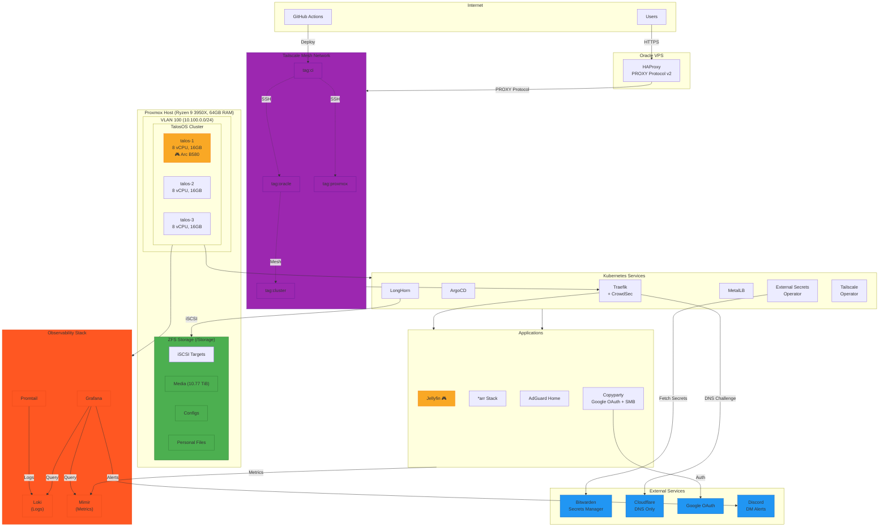
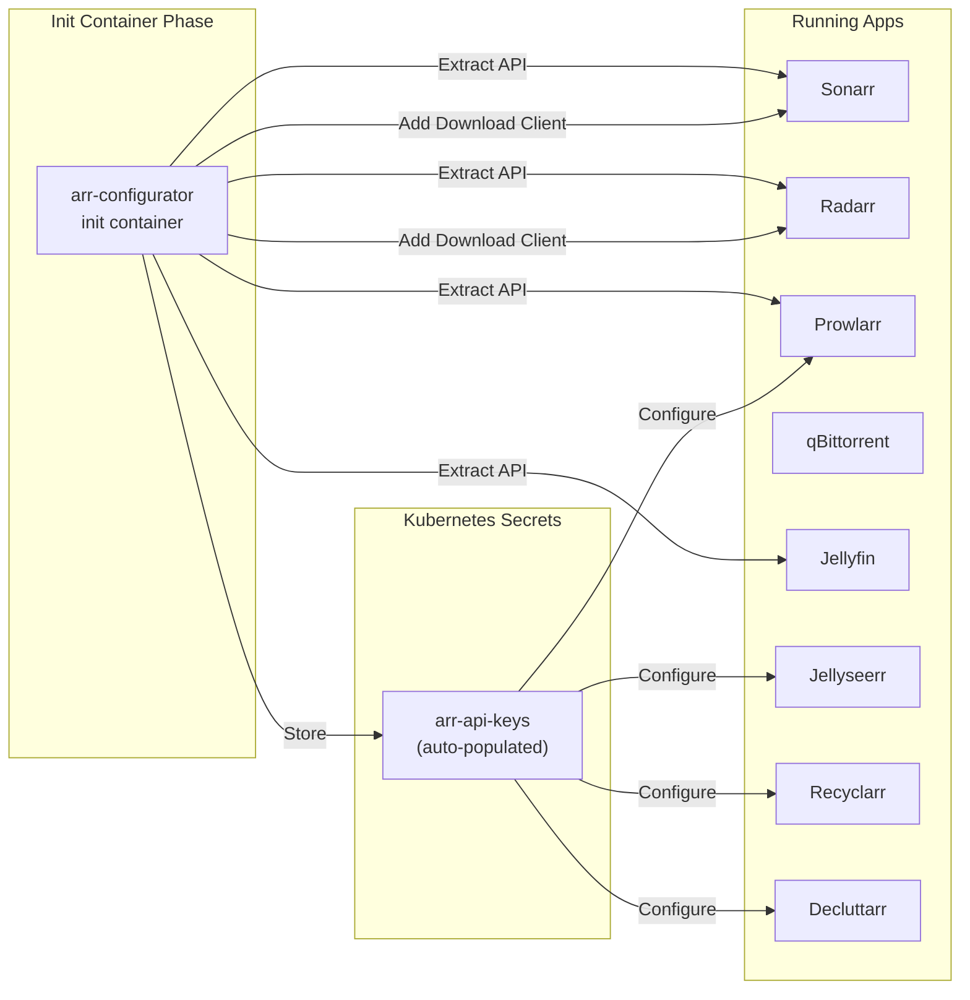

# Migration Plan: K3s → TalosOS with GitOps

Complete migration from K3s on Proxmox LXC containers to TalosOS VMs with full GitOps workflow.

---

## Architecture Diagram



---

## 1. Architecture Overview

### Current State

- K3s running on Proxmox LXC containers
- Manual configuration and deployments

### Target State

- **TalosOS** on Proxmox VMs (immutable, API-driven Kubernetes OS)
- **3 combined control-plane + worker nodes**
- **Intel Arc B580 GPU** passthrough to one node (talos-1)
- **GitOps** with ArgoCD for application deployment
- **Tailscale** mesh networking for multi-cloud node joining and kubectl access
- **Bitwarden** for secrets management via External Secrets Operator
- **Oracle VPS** as HAProxy entry point only (not a K8s node)

### Host Resources

```
Host: MS-7C37 (Proxmox)
CPU: AMD Ryzen 9 3950X (32 threads) @ 5.41 GHz
GPU: Intel Arc B580 @ 2.85 GHz [Discrete]
RAM: 62.71 GiB total
Storage:
  - / (root): 93.93 GiB ext4
  - /Storage: 10.77 TiB ZFS pool (media, configs, personal files)
```

### VM Configuration (3 nodes)

| Node      | Role                   | vCPU | RAM    | Disk   | GPU            | IP          |
| --------- | ---------------------- | ---- | ------ | ------ | -------------- | ----------- |
| `talos-1` | control-plane + worker | 8    | 16 GiB | 64 GiB | Intel Arc B580 | 10.100.0.11 |
| `talos-2` | control-plane + worker | 8    | 16 GiB | 64 GiB | -              | 10.100.0.12 |
| `talos-3` | control-plane + worker | 8    | 16 GiB | 64 GiB | -              | 10.100.0.13 |

**Resource Allocation:**

- **Total allocated:** 24 vCPU, 48 GiB RAM (leaves ~15 GiB for Proxmox + headroom)
- **Remaining for host:** 8 threads, ~15 GiB RAM
- Each VM uses q35 machine type, OVMF BIOS, VirtIO SCSI
- `talos-1` gets GPU passthrough via `hostpci` block

---

## 2. Infrastructure Components

### 2.1 Terraform (Infrastructure as Code)

**Providers:**

- `bpg/proxmox` - Proxmox VM provisioning with GPU passthrough
- `siderolabs/talos` - TalosOS cluster configuration
- `oci` - Oracle Cloud Infrastructure (VPS instance)
- `cloudflare` - DNS management
- `tailscale` - ACL policy management (GitOps)
- `bitwarden/bitwarden-secrets` - Secrets management (project & secrets creation)

**Resources to create:**

- **Proxmox:** TalosOS VMs (3x), GPU passthrough, machine configs, extensions
- **Oracle VPS:** Compute instance for HAProxy (bootstrapped by Ansible)
- **Cloudflare:** DNS records for cluster endpoints
- **Tailscale:** ACL policy with tag-based rules
- **Bitwarden:** `interstellar` project with infrastructure secrets

**Bitwarden Secrets Manager (Terraform):**

```hcl
terraform {
  required_providers {
    bitwarden-secrets = {
      source  = "bitwarden/bitwarden-secrets"
      version = "~> 0.5"
    }
  }
}

provider "bitwarden-secrets" {
  api_url         = "https://api.bitwarden.com"
  identity_url    = "https://identity.bitwarden.com"
  access_token    = var.bw_access_token  # From environment: BW_ACCESS_TOKEN
  organization_id = var.bw_organization_id
}

# Secrets are created manually in Bitwarden, then referenced via data sources
# This allows dynamic updates without Terraform changes

data "bitwarden-secrets_secret" "tailscale_api_key" {
  id = var.bw_secret_ids.tailscale_api_key
}

data "bitwarden-secrets_secret" "tailscale_tailnet" {
  id = var.bw_secret_ids.tailscale_tailnet
}

data "bitwarden-secrets_secret" "google_oauth_client_id" {
  id = var.bw_secret_ids.google_oauth_client_id
}

data "bitwarden-secrets_secret" "google_oauth_client_secret" {
  id = var.bw_secret_ids.google_oauth_client_secret
}

data "bitwarden-secrets_secret" "copyparty_admins" {
  id = var.bw_secret_ids.copyparty_admins
}

data "bitwarden-secrets_secret" "copyparty_writers" {
  id = var.bw_secret_ids.copyparty_writers
}
```

**Bitwarden Project Structure:**

| Project        | Secrets                                   | Created By |
| -------------- | ----------------------------------------- | ---------- |
| `OCIAccess`    | OCI API credentials for Terraform backend | Manual     |
| `interstellar` | All other infrastructure secrets          | Terraform  |

**Secrets in `OCIAccess` Project (manually created):**

| Key                | Description                       |
| ------------------ | --------------------------------- |
| `oci-tenancy-ocid` | OCI Tenancy OCID for backend auth |
| `oci-user-ocid`    | OCI User OCID for backend auth    |
| `oci-fingerprint`  | OCI API Key fingerprint           |
| `oci-private-key`  | OCI API private key (PEM format)  |
| `oci-region`       | OCI region (e.g., us-ashburn-1)   |
| `oci-namespace`    | OCI Object Storage namespace      |

**Secrets in `interstellar` Project:**

| Key                          | Description                        |
| ---------------------------- | ---------------------------------- |
| `tailscale-api-key`          | Tailscale API key for ACL sync     |
| `tailscale-tailnet`          | Tailscale tailnet name             |
| `tailscale-oauth-client-id`  | Tailscale OAuth client ID (for CI) |
| `tailscale-oauth-secret`     | Tailscale OAuth secret (for CI)    |
| `google-oauth-client-id`     | Google OAuth client ID             |
| `google-oauth-client-secret` | Google OAuth client secret         |
| `google-oauth-cookie-secret` | OAuth2-Proxy cookie secret         |
| `copyparty-admins`           | Comma-separated admin emails       |
| `copyparty-writers`          | Comma-separated writer emails      |
| `crowdsec-api-key`           | CrowdSec LAPI key                  |
| `cloudflare-api-token`       | Cloudflare API token for DNS       |
| `proxmox-api-token-id`       | Proxmox API token ID               |
| `proxmox-api-token-secret`   | Proxmox API token secret           |
| `discord-webhook-url`        | Discord DM webhook for alerts      |

**TalosOS Extensions:**

- `qemu-guest-agent` - Proxmox integration
- `iscsi-tools` - LongHorn iSCSI storage
- `util-linux-tools` - Required utilities
- `tailscale` - Mesh networking
- `intel-ucode` - Intel microcode updates

### 2.2 Proxmox Configuration

**VLAN Setup (Linux VLAN on Proxmox):**

```bash
# /etc/network/interfaces on Proxmox host
auto vmbr0
iface vmbr0 inet static
    address 192.168.1.10/24
    gateway 192.168.1.1
    bridge-ports enp0s31f6
    bridge-stp off
    bridge-fd 0
    # Main LAN - personal devices, Proxmox management

auto vmbr0.100
iface vmbr0.100 inet manual
    # VLAN 100 - Cluster network (tagged)

auto vmbr1
iface vmbr1 inet static
    address 10.100.0.1/24
    bridge-ports vmbr0.100
    bridge-stp off
    bridge-fd 0
    # Cluster bridge - TalosOS nodes connect here
    # Acts as gateway for cluster VLAN
    post-up echo 1 > /proc/sys/net/ipv4/ip_forward
```

**Proxmox Firewall (Datacenter → Firewall → Rules):**

| #   | Type | Action | Source         | Dest            | Proto | DPort    | Comment                   |
| --- | ---- | ------ | -------------- | --------------- | ----- | -------- | ------------------------- |
| 1   | in   | ACCEPT | 10.100.0.0/24  | 0.0.0.0/0       | tcp   | 80,443   | Cluster → Internet HTTP/S |
| 2   | in   | ACCEPT | 10.100.0.0/24  | 0.0.0.0/0       | udp   | 53,41641 | Cluster → DNS, Tailscale  |
| 3   | in   | ACCEPT | 10.100.0.0/24  | 192.168.1.10/32 | tcp   | 3260     | Cluster → Proxmox iSCSI   |
| 4   | in   | DROP   | 10.100.0.0/24  | 10.0.0.0/8      | -     | -        | Block cluster → RFC1918   |
| 5   | in   | DROP   | 10.100.0.0/24  | 172.16.0.0/12   | -     | -        | Block cluster → RFC1918   |
| 6   | in   | DROP   | 10.100.0.0/24  | 192.168.0.0/16  | -     | -        | Block cluster → RFC1918   |
| 7   | in   | ACCEPT | 192.168.1.0/24 | 10.100.0.0/24   | -     | -        | Personal → Cluster (all)  |

**Proxmox Firewall Config (`/etc/pve/firewall/cluster.fw`):**

```ini
[OPTIONS]
enable: 1
policy_in: DROP
policy_out: ACCEPT

[RULES]
# Cluster can reach internet (HTTP/S, DNS, Tailscale)
IN ACCEPT -source 10.100.0.0/24 -dest 0.0.0.0/0 -p tcp -dport 80,443
IN ACCEPT -source 10.100.0.0/24 -dest 0.0.0.0/0 -p udp -dport 53,41641

# Cluster can reach Proxmox for iSCSI storage
IN ACCEPT -source 10.100.0.0/24 -dest 192.168.1.10/32 -p tcp -dport 3260

# Block cluster from reaching any local network
IN DROP -source 10.100.0.0/24 -dest 10.0.0.0/8
IN DROP -source 10.100.0.0/24 -dest 172.16.0.0/12
IN DROP -source 10.100.0.0/24 -dest 192.168.0.0/16

# Allow personal devices to reach cluster
IN ACCEPT -source 192.168.1.0/24 -dest 10.100.0.0/24
```

**VM Network Config:**

- TalosOS VMs use `vmbr1` (cluster VLAN bridge)
- Assign static IPs in 10.100.0.0/24 range
- Gateway: 10.100.0.1 (Proxmox host on vmbr1)

**NAT for Internet Access (on Proxmox host):**

```bash
# /etc/network/interfaces - add to vmbr1 section
post-up iptables -t nat -A POSTROUTING -s 10.100.0.0/24 -o vmbr0 -j MASQUERADE
post-down iptables -t nat -D POSTROUTING -s 10.100.0.0/24 -o vmbr0 -j MASQUERADE
```

**Network Topology:**

- `vmbr0` (192.168.1.0/24) - Main LAN with personal devices
- `vmbr1` (10.100.0.0/24) - Cluster VLAN, isolated, NAT to internet
- Cluster nodes get internet via Proxmox NAT but cannot initiate to RFC1918

**Storage (targetcli on Proxmox host):**

- **HDD LUN** - Media storage (iSCSI for LongHorn)
- **SSD LUN (configs)** - Application configs (iSCSI for LongHorn)
- **SSD LUN (shared)** - Shared storage (iSCSI for LongHorn)

### 2.3 Oracle VPS (HAProxy Entry Point)

**Purpose:** Public internet entry point with PROXY protocol, NOT a Kubernetes node

**Provisioning:** Terraform (`oci` provider) → Ansible configuration

**Terraform Resources:**

```hcl
resource "oci_core_instance" "haproxy" {
  availability_domain = data.oci_identity_availability_domains.ads.availability_domains[0].name
  compartment_id      = var.compartment_id

  # Boot from Oracle Linux 8
  image_id = data.oci_core_images.oracle_linux.images[0].id
  shape    = "VM.Standard.A1.Flex" # ARM-based, cost-effective

  shape_config {
    memory_in_gbs             = 1  # Minimal: HAProxy doesn't need much
    ocpus                     = 1
  }

  create_vnic_details {
    assign_public_ip = true
    subnet_id        = oci_core_subnet.public.id
  }

  metadata = {
    ssh_authorized_keys = file("${path.module}/../.private/oracle_ssh_key.pub")
  }
}

# Store SSH key in OCI Object Storage for Ansible
resource "oci_objectstorage_object" "oracle_ssh_key" {
  bucket    = oci_objectstorage_bucket.terraform.name
  namespace = data.oci_objectstorage_namespace.namespace.namespace
  object    = "oracle_ssh_key.pem"
  content   = file("${path.module}/../.private/oracle_ssh_key")
}

# Output Oracle instance IP for Ansible inventory
output "oracle_public_ip" {
  value = oci_core_instance.haproxy.public_ip
}
```

**Files:**

- `compose.proxy.yaml` - Docker Compose for HAProxy + Watchtower + Tailscale
- `haproxy.cfg` - HAProxy configuration with PROXY protocol v2

**compose.proxy.yaml:**

```yaml
services:
  haproxy:
    container_name: haproxy
    image: haproxy:latest
    ports:
      - "80:80"
      - "443:443"
    volumes:
      - ./haproxy.cfg:/usr/local/etc/haproxy/haproxy.cfg:ro
    restart: unless-stopped
    network_mode: host # For Tailscale IP resolution

  watchtower:
    container_name: watchtower
    image: containrrr/watchtower:latest
    volumes:
      - /var/run/docker.sock:/var/run/docker.sock
    restart: unless-stopped
    environment:
      - WATCHTOWER_CLEANUP=true
      - WATCHTOWER_POLL_INTERVAL=86400 # Daily updates

  tailscale:
    container_name: tailscale
    image: tailscale/tailscale:latest
    hostname: oracle-haproxy
    volumes:
      - tailscale-state:/var/lib/tailscale
      - /dev/net/tun:/dev/net/tun
    cap_add:
      - NET_ADMIN
      - NET_RAW
    environment:
      - TS_AUTHKEY=${TS_AUTHKEY} # From Bitwarden, one-time use
      - TS_EXTRA_ARGS=--advertise-tags=tag:oracle
      - TS_STATE_DIR=/var/lib/tailscale
    restart: unless-stopped

volumes:
  tailscale-state:
```

**haproxy.cfg:**

```haproxy
global
    log stdout format raw local0

defaults
    mode tcp
    log global
    option tcplog
    timeout connect 10s
    timeout client 30s
    timeout server 30s

frontend http
    bind *:80
    default_backend traefik-http

frontend https
    bind *:443
    default_backend traefik-https

backend traefik-http
    # Traefik's Tailscale IP (from tailscale status)
    server traefik talos-traefik:80 send-proxy-v2

backend traefik-https
    # Traefik's Tailscale IP (from tailscale status)
    server traefik talos-traefik:443 send-proxy-v2
```

**Note:** `talos-traefik` is the MagicDNS hostname of the Tailscale Kubernetes Operator's Traefik service. HAProxy resolves this via Tailscale's DNS.

**Ansible Playbook (setup-oracle.yaml) updates Docker Compose and restarts:**

```yaml
- name: Setup Oracle HAProxy
  hosts: oracle
  tasks:
    - name: Copy Docker Compose files
      copy:
        src: "{{ item }}"
        dest: /opt/haproxy/
      loop:
        - compose.proxy.yaml
        - haproxy.cfg

    - name: Start HAProxy stack
      community.docker.docker_compose_v2:
        project_src: /opt/haproxy
        files:
          - compose.proxy.yaml
        state: present
        pull: always
```

**Auto-Updates on Oracle VPS:**

**Container Updates (Watchtower):**

Already configured in `compose.proxy.yaml`:

```yaml
watchtower:
  container_name: watchtower
  image: containrrr/watchtower:latest
  volumes:
    - /var/run/docker.sock:/var/run/docker.sock
  restart: unless-stopped
  environment:
    - WATCHTOWER_CLEANUP=true
    - WATCHTOWER_POLL_INTERVAL=86400 # Daily: check for updates at 2 AM UTC
    - WATCHTOWER_SCHEDULE=0 2 * * * # Cron: 2 AM UTC daily
```

Watchtower automatically:

- Checks for new image versions daily
- Pulls latest images (HAProxy, Tailscale)
- Stops old containers
- Starts new containers with same config
- Cleans up old images

**System Package Updates (Ansible scheduled task):**

Add to `setup-oracle.yaml`:

```yaml
- name: Configure unattended-upgrades
  ansible.builtin.apt:
    name: unattended-upgrades
    state: present

- name: Configure unattended-upgrades to auto-reboot
  ansible.builtin.copy:
    content: |
      Unattended-Upgrade::Allowed-Origins {
        "${distro_id}:${distro_codename}";
        "${distro_id}:${distro_codename}-security";
        "${distro_id}ESMApps:${distro_codename}-apps-security";
        "${distro_id}ESM:${distro_codename}-infra-security";
      };
      Unattended-Upgrade::AutoFixInterruptedDpkg "true";
      Unattended-Upgrade::MinimalSteps "true";
      Unattended-Upgrade::InstallOnShutdown "false";
      Unattended-Upgrade::Automatic-Reboot "true";
      Unattended-Upgrade::Automatic-Reboot-Time "03:00"; # 3 AM UTC
      Unattended-Upgrade::SyslogReport "only-on-change";
    dest: /etc/apt/apt.conf.d/50unattended-upgrades

- name: Enable unattended-upgrades
  ansible.builtin.systemd:
    name: unattended-upgrades
    enabled: yes
    state: started
```

**Update Flow:**

1. **2 AM UTC daily:** Watchtower checks for new container images
2. **3 AM UTC daily:** unattended-upgrades applies system package updates
3. **Auto-reboot if needed:** System reboots if kernel updates require it
4. **Container restart on reboot:** Docker services restart automatically (due to `restart: unless-stopped`)

---

## 3. Kubernetes Bootstrap Components

### 3.1 MetalLB (LoadBalancer)

- L2 advertisement for LoadBalancer IPs on VLAN
- Dedicated IP pool for cluster services

### 3.2 LongHorn (Storage)

- Distributed block storage backed by Proxmox iSCSI targets
- Replicated volumes for high availability

### 3.3 Traefik (Ingress Controller)

**Features:**

- PROXY protocol support (from Oracle HAProxy)
- CrowdSec bouncer middleware integration
- Timeout and rate-limiting middlewares

**Middlewares:**

| Middleware          | Purpose                         |
| ------------------- | ------------------------------- |
| `crowdsec`          | ForwardAuth to CrowdSec bouncer |
| `timeout-standard`  | 60s read/write, 180s idle       |
| `timeout-streaming` | Unlimited for media streaming   |
| `rate-limit`        | 100 req/min, burst 200          |
| `security-headers`  | HSTS, XSS protection, etc.      |
| `tailscale-only`    | IP allowlist 100.64.0.0/10      |

**Middleware Chains:**

| Chain             | Middlewares                                                 | Use Case            |
| ----------------- | ----------------------------------------------------------- | ------------------- |
| `public-chain`    | crowdsec → rate-limit → security-headers → timeout-standard | Public web services |
| `streaming-chain` | crowdsec → security-headers → timeout-streaming             | Jellyfin, streaming |
| `tailscale-only`  | tailscale-only → timeout-standard                           | Internal services   |

### 3.4 CrowdSec (Security)

**Components:**

- **LAPI** - Local API for decision engine
- **Traefik Bouncer** - Middleware for blocking malicious IPs
- **Collections** - crowdsecurity/traefik, crowdsecurity/http-cve

### 3.5 External Secrets Operator

**Provider:** Bitwarden Secrets Manager via SDK Server

- Sync secrets from Bitwarden to Kubernetes Secrets
- No secrets stored in Git repository

### 3.6 Tailscale Kubernetes Operator

**Features:**

- API Server Proxy for kubectl access from any Tailscale device
- Subnet router for pod/service CIDRs
- No VPN client installation needed - just `tailscale configure kubeconfig <hostname>`

### 3.7 Observability Stack (Grafana LGTM)

**Components:**

| Component    | Purpose                            | Storage      |
| ------------ | ---------------------------------- | ------------ |
| **Grafana**  | Dashboards & alerting              | SQLite/PVC   |
| **Loki**     | Log aggregation                    | LongHorn PVC |
| **Mimir**    | Metrics (Prometheus-compatible)    | LongHorn PVC |
| **Promtail** | Log collector (DaemonSet)          | -            |
| **Alloy**    | Metrics collector (replaces agent) | -            |

**Helm Installation:**

```yaml
# ArgoCD Application for Grafana stack
apiVersion: argoproj.io/v1alpha1
kind: Application
metadata:
  name: grafana
  namespace: argocd
spec:
  project: default
  source:
    repoURL: https://grafana.github.io/helm-charts
    chart: grafana
    targetRevision: 8.x
    helm:
      values: |
        persistence:
          enabled: true
          storageClassName: longhorn
        datasources:
          datasources.yaml:
            apiVersion: 1
            datasources:
              - name: Loki
                type: loki
                url: http://loki:3100
                isDefault: false
              - name: Mimir
                type: prometheus
                url: http://mimir:9009/prometheus
                isDefault: true
        grafana.ini:
          server:
            root_url: https://grafana.nerine.dev
          auth.anonymous:
            enabled: false
  destination:
    server: https://kubernetes.default.svc
    namespace: monitoring
  syncPolicy:
    automated:
      prune: true
      selfHeal: true
```

```yaml
# Loki (log aggregation)
apiVersion: argoproj.io/v1alpha1
kind: Application
metadata:
  name: loki
  namespace: argocd
spec:
  project: default
  source:
    repoURL: https://grafana.github.io/helm-charts
    chart: loki
    targetRevision: 6.x
    helm:
      values: |
        loki:
          auth_enabled: false
          commonConfig:
            replication_factor: 1
          storage:
            type: filesystem
        singleBinary:
          replicas: 1
          persistence:
            enabled: true
            storageClass: longhorn
            size: 50Gi
  destination:
    server: https://kubernetes.default.svc
    namespace: monitoring
```

```yaml
# Mimir (metrics)
apiVersion: argoproj.io/v1alpha1
kind: Application
metadata:
  name: mimir
  namespace: argocd
spec:
  project: default
  source:
    repoURL: https://grafana.github.io/helm-charts
    chart: mimir-distributed
    targetRevision: 5.x
    helm:
      values: |
        mimir:
          structuredConfig:
            common:
              storage:
                backend: filesystem
        minio:
          enabled: false
        compactor:
          persistence:
            storageClass: longhorn
        ingester:
          persistence:
            storageClass: longhorn
        store_gateway:
          persistence:
            storageClass: longhorn
  destination:
    server: https://kubernetes.default.svc
    namespace: monitoring
```

```yaml
# Promtail (log collector)
apiVersion: argoproj.io/v1alpha1
kind: Application
metadata:
  name: promtail
  namespace: argocd
spec:
  project: default
  source:
    repoURL: https://grafana.github.io/helm-charts
    chart: promtail
    targetRevision: 6.x
    helm:
      values: |
        config:
          clients:
            - url: http://loki:3100/loki/api/v1/push
  destination:
    server: https://kubernetes.default.svc
    namespace: monitoring
```

**Grafana Alerting with Discord DM:**

```yaml
# ExternalSecret for Discord webhook
apiVersion: external-secrets.io/v1beta1
kind: ExternalSecret
metadata:
  name: discord-webhook
  namespace: monitoring
spec:
  secretStoreRef:
    name: bitwarden
    kind: ClusterSecretStore
  target:
    name: discord-webhook
  data:
    - secretKey: webhook-url
      remoteRef:
        key: discord-webhook-url # Your DM webhook URL
```

**Discord Contact Point Configuration (in Grafana UI or provisioning):**

```yaml
# Grafana alerting provisioning
apiVersion: 1
contactPoints:
  - orgId: 1
    name: discord-dm
    receivers:
      - uid: discord-dm
        type: discord
        settings:
          url: ${DISCORD_WEBHOOK_URL}
          use_discord_username: true
          message: |
            **{{ .Status | toUpper }}** {{ if eq .Status "firing" }}🔥{{ else }}✅{{ end }}
            {{ range .Alerts }}
            **Alert:** {{ .Labels.alertname }}
            **Severity:** {{ .Labels.severity }}
            **Summary:** {{ .Annotations.summary }}
            **Description:** {{ .Annotations.description }}
            {{ end }}

policies:
  - orgId: 1
    receiver: discord-dm
    group_by:
      - alertname
      - severity
    group_wait: 30s
    group_interval: 5m
    repeat_interval: 4h
```

**Getting Discord DM Webhook:**

1. Create a Discord server (just for you, can be empty)
2. Create a channel for alerts
3. Channel Settings → Integrations → Webhooks → New Webhook
4. Copy webhook URL → Store in Bitwarden as `discord-webhook-url`

**Pre-configured Alert Rules:**

| Alert                        | Condition                   | Severity |
| ---------------------------- | --------------------------- | -------- |
| `HighCPU`                    | Node CPU > 80% for 5m       | warning  |
| `HighMemory`                 | Node Memory > 85% for 5m    | warning  |
| `PodCrashLooping`            | Pod restarts > 5 in 10m     | critical |
| `PodNotReady`                | Pod not ready for 5m        | warning  |
| `PVCAlmostFull`              | PVC usage > 85%             | warning  |
| `NodeNotReady`               | Node not ready for 5m       | critical |
| `TargetDown`                 | Scrape target down for 5m   | critical |
| `DeploymentReplicasMismatch` | Desired ≠ Available for 10m | warning  |
| `CrowdSecBan`                | New IP banned by CrowdSec   | info     |
| `CertificateExpiringSoon`    | Cert expires in < 14 days   | warning  |

**Application-Specific Alerts (via Exportarr + Log Parsing):**

The \*arr apps expose metrics via their API. Use [Exportarr](https://github.com/onedr0p/exportarr) to scrape them:

```yaml
# Exportarr sidecar for Prowlarr (same pattern for Sonarr, Radarr, etc.)
apiVersion: apps/v1
kind: Deployment
metadata:
  name: prowlarr
spec:
  template:
    spec:
      containers:
        - name: prowlarr
          # ... main container
        - name: exportarr
          image: ghcr.io/onedr0p/exportarr:latest
          args:
            - prowlarr
          env:
            - name: URL
              value: http://localhost:9696
            - name: APIKEY
              valueFrom:
                secretKeyRef:
                  name: prowlarr-api
                  key: api-key
            - name: PORT
              value: "9707"
          ports:
            - name: metrics
              containerPort: 9707
```

```yaml
# ServiceMonitor for Prometheus/Mimir scraping
apiVersion: monitoring.coreos.com/v1
kind: ServiceMonitor
metadata:
  name: prowlarr
  namespace: media
spec:
  selector:
    matchLabels:
      app: prowlarr
  endpoints:
    - port: metrics
      interval: 60s
```

**Application Alert Rules:**

| Alert                        | App         | Condition                            | Severity |
| ---------------------------- | ----------- | ------------------------------------ | -------- |
| `ProwlarrIndexerFailing`     | Prowlarr    | Indexer failure count > 0 for 15m    | warning  |
| `ProwlarrIndexerDown`        | Prowlarr    | Indexer unavailable for 30m          | critical |
| `SonarrQueueStuck`           | Sonarr      | Queue items not processing for 1h    | warning  |
| `SonarrDiskSpaceLow`         | Sonarr      | Root folder < 50GB free              | warning  |
| `RadarrQueueStuck`           | Radarr      | Queue items not processing for 1h    | warning  |
| `RadarrDiskSpaceLow`         | Radarr      | Root folder < 50GB free              | warning  |
| `QBittorrentDownloadStalled` | qBittorrent | Stalled torrents > 0 for 2h          | warning  |
| `QBittorrentNoSeeders`       | qBittorrent | Downloads with 0 seeders for 4h      | info     |
| `JellyfinTranscodeFailing`   | Jellyfin    | Transcode errors in logs             | warning  |
| `JellyfinPlaybackErrors`     | Jellyfin    | Playback error rate > 5% for 10m     | warning  |
| `BazarrSubtitlesFailing`     | Bazarr      | Failed subtitle downloads > 5 for 1h | warning  |

**Loki Log-Based Alerts (for apps without metrics):**

```yaml
# Grafana alert rule for Prowlarr indexer failures via logs
apiVersion: 1
groups:
  - orgId: 1
    name: arr-apps
    folder: Applications
    interval: 1m
    rules:
      - uid: prowlarr-indexer-failing
        title: Prowlarr Indexer Failing
        condition: C
        data:
          - refId: A
            relativeTimeRange:
              from: 900 # 15 minutes
              to: 0
            datasourceUid: loki
            model:
              expr: |
                count_over_time({app="prowlarr"} |~ "(?i)indexer.*failed|error.*indexer" [15m])
          - refId: C
            datasourceUid: __expr__
            model:
              type: threshold
              expression: A
              conditions:
                - evaluator:
                    type: gt
                    params: [0]
        annotations:
          summary: "Prowlarr indexer is failing"
          description: "One or more indexers in Prowlarr have reported failures in the last 15 minutes"
        labels:
          severity: warning
        for: 5m

      - uid: qbittorrent-stalled
        title: qBittorrent Downloads Stalled
        condition: C
        data:
          - refId: A
            relativeTimeRange:
              from: 7200 # 2 hours
              to: 0
            datasourceUid: loki
            model:
              expr: |
                count_over_time({app="qbittorrent"} |~ "(?i)stalled" [2h])
          - refId: C
            datasourceUid: __expr__
            model:
              type: threshold
              expression: A
              conditions:
                - evaluator:
                    type: gt
                    params: [0]
        annotations:
          summary: "qBittorrent has stalled downloads"
          description: "Downloads have been stalled for over 2 hours"
        labels:
          severity: warning
        for: 10m
```

**Exportarr Metrics Available:**

| App         | Key Metrics                                                 |
| ----------- | ----------------------------------------------------------- |
| Prowlarr    | `prowlarr_indexer_*`, `prowlarr_grab_*`, `prowlarr_query_*` |
| Sonarr      | `sonarr_queue_*`, `sonarr_series_*`, `sonarr_episode_*`     |
| Radarr      | `radarr_queue_*`, `radarr_movie_*`, `radarr_download_*`     |
| Bazarr      | `bazarr_subtitles_*`, `bazarr_episodes_*`                   |
| qBittorrent | Via qbittorrent-exporter: `qbittorrent_*`                   |
| Jellyfin    | Via jellyfin-exporter or logs                               |

**Ingress:**

```yaml
# Grafana IngressRoute (Tailscale only)
apiVersion: traefik.io/v1alpha1
kind: IngressRoute
metadata:
  name: grafana
  namespace: monitoring
spec:
  entryPoints:
    - websecure
  routes:
    - match: Host(`grafana.nerine.dev`)
      kind: Rule
      middlewares:
        - name: tailscale-only
          namespace: traefik
      services:
        - name: grafana
          port: 80
  tls:
    certResolver: letsencrypt
```

---

## 4. Tailscale ACL Policy (GitOps)

### 4.1 Tags

| Tag                | Purpose                |
| ------------------ | ---------------------- |
| `tag:ci`           | GitHub Actions runners |
| `tag:proxmox`      | Proxmox hosts          |
| `tag:oracle`       | Oracle VPS (HAProxy)   |
| `tag:cluster`      | All Kubernetes nodes   |
| `tag:k8s-operator` | Tailscale K8s operator |

### 4.2 Groups

| Group             | Purpose                                   |
| ----------------- | ----------------------------------------- |
| `group:vips`      | Admin-level access (full cluster control) |
| `group:silvernet` | Science club members                      |
| `group:media`     | Jellyfin/Jellyseerr access only           |
| `group:dns`       | AdGuard DNS access (port 53 only)         |

**Tailscale Group Permissions (ACL Rules):**

| Group             | Can Access                                | Cannot Access    |
| ----------------- | ----------------------------------------- | ---------------- |
| `group:vips`      | Everything (all tags, all devices)        | -                |
| `group:silvernet` | Cluster services, shared resources        | Personal devices |
| `group:media`     | `watch.nerine.dev`, `add.nerine.dev` only | Everything else  |
| `group:dns`       | AdGuard DNS (port 53 UDP/TCP)             | Everything else  |

**What each Tailscale group can do:**

1. **group:vips** (you + trusted admins):

   - SSH to all tagged machines (proxmox, cluster, oracle)
   - Access all cluster services via Tailscale
   - kubectl admin access via Tailscale Operator
   - Manage Tailscale devices and ACLs

2. **group:silvernet** (science club members):

   - Access cluster services (same as vips, but limited)
   - Cannot SSH to infrastructure
   - Cannot access personal devices on the network

3. **group:media** (friends/family for streaming):
   - Access ONLY: `watch.nerine.dev` (Jellyfin), `add.nerine.dev` (Jellyseerr)
   - Cannot access any other service
   - Cannot see other devices on the tailnet
   - Perfect for sharing media without exposing infrastructure

**ACL Example:**

```hujson
{
  "acls": [
    // VIPs get full access
    {"action": "accept", "src": ["group:vips"], "dst": ["*:*"]},

    // Silvernet can access cluster services
    {"action": "accept", "src": ["group:silvernet"], "dst": ["tag:cluster:*"]},

    // Media group can ONLY access Jellyfin and Jellyseerr ports
    {"action": "accept", "src": ["group:media"], "dst": ["tag:cluster:80,443"]},

    // DNS group can access AdGuard DNS only
    {"action": "accept", "src": ["group:dns"], "dst": ["tag:cluster:53"]},

    // Cluster cannot reach personal devices (unidirectional)
    {"action": "accept", "src": ["tag:cluster"], "dst": ["tag:cluster:*", "tag:proxmox:3260"]},
  ]
}
```

### 4.3 Security Rules

- **Unidirectional access:** Cluster cannot initiate connections to personal devices
- **Media group isolation:** Only access to Jellyfin/Jellyseerr services
- **DNS group isolation:** Only access to AdGuard DNS (port 53)
- **Auto-approvers:** Exit node (Oracle), subnet routes (pod/service CIDRs)

### 4.4 Tailscale Auth Key (Terraform)

```hcl
# Generate reusable auth key for TalosOS nodes
resource "tailscale_tailnet_key" "talos_nodes" {
  reusable      = true
  ephemeral     = false
  preauthorized = true
  expiry        = 7776000  # 90 days in seconds
  tags          = ["tag:cluster"]
  description   = "TalosOS cluster nodes"
}

# Store auth key in Bitwarden for External Secrets
resource "bitwarden-secrets_secret" "tailscale_auth_key" {
  key        = "tailscale-auth-key"
  value      = tailscale_tailnet_key.talos_nodes.key
  project_id = data.bitwarden-secrets_project.interstellar.id
  note       = "Auto-generated by Terraform for TalosOS nodes"
}
```

### 4.5 GitHub Actions Sync

**Secrets from Bitwarden** - GitHub Actions fetches secrets from Bitwarden Secrets Manager:

```yaml
# .github/workflows/tailscale-acl.yaml
jobs:
  sync-acl:
    runs-on: ubuntu-latest
    steps:
      - uses: actions/checkout@v4

      - name: Get Bitwarden Secrets
        uses: bitwarden/sm-action@v2
        with:
          access_token: ${{ secrets.BW_ACCESS_TOKEN }} # Only secret stored in GitHub
          secrets: |
            tailscale-api-key > TAILSCALE_API_KEY
            tailscale-tailnet > TAILSCALE_TAILNET

      - uses: tailscale/gitops-acl-action@v1
        with:
          tailnet: ${{ env.TAILSCALE_TAILNET }}
          api-key: ${{ env.TAILSCALE_API_KEY }}
          policy-file: Tailscale/policy.hujson
```

**Note:** Only `BW_ACCESS_TOKEN` is stored in GitHub Secrets. All other secrets are fetched from Bitwarden at runtime.

---

## 5. Storage Architecture

### 5.1 ZFS Pool on Proxmox (`/Storage`)

**Current:** 10.77 TiB ZFS pool mounted at `/Storage`

```
/Storage/
├── Media/          # Movies, TV, Music (existing data to migrate)
├── Configs/        # Application configs
├── Personal/       # Personal files with public subfolder
│   └── public/     # Shared publicly via Copyparty
└── ... (other data)
```

**ZFS Datasets to create (you'll populate the list):**

| Dataset                | Purpose        | Quota | Notes                            |
| ---------------------- | -------------- | ----- | -------------------------------- |
| `Storage/k8s/media`    | Media files    | -     | Existing data migration          |
| `Storage/k8s/configs`  | App configs    | 100G  | SSD-like performance via ZFS ARC |
| `Storage/k8s/personal` | Personal files | 500G  | With public subfolder            |

### 5.2 Proxmox iSCSI Targets (via targetcli)

**ZFS zvols as iSCSI LUNs:**

| Target                            | ZFS zvol                   | Size | Purpose                   |
| --------------------------------- | -------------------------- | ---- | ------------------------- |
| `iqn.2025-01.dev.nerine:media`    | `Storage/k8s/media-lun`    | 5T   | Media (movies, TV, music) |
| `iqn.2025-01.dev.nerine:configs`  | `Storage/k8s/configs-lun`  | 100G | Application configs       |
| `iqn.2025-01.dev.nerine:personal` | `Storage/k8s/personal-lun` | 500G | Personal files            |

**Create zvols on Proxmox:**

```bash
# Create zvols for iSCSI (you'll run these with actual sizes)
zfs create -V 5T Storage/k8s/media-lun
zfs create -V 100G Storage/k8s/configs-lun
zfs create -V 500G Storage/k8s/personal-lun
```

### 5.3 LongHorn Storage Classes

| StorageClass        | Backend        | Access        | Use Case               |
| ------------------- | -------------- | ------------- | ---------------------- |
| `longhorn-media`    | media iSCSI    | ReadWriteMany | Jellyfin, \*arr apps   |
| `longhorn-configs`  | configs iSCSI  | ReadWriteOnce | App configs, databases |
| `longhorn-personal` | personal iSCSI | ReadWriteMany | Copyparty              |

### 5.4 Data Migration

**Existing data on current K3s setup:**

- Media files at `/Storage/Media` (hostPath in current Jellyfin)
- Config data in LXC container at `/Storage` mount

**Migration strategy:**

1. Keep ZFS pool intact during migration
2. Create new zvols for iSCSI alongside existing data
3. Copy data from existing paths to new LongHorn volumes
4. Verify, then clean up old structure

---

## 6. Copyparty (File Server)

### 6.1 Authentication

- **Google OAuth** via OAuth2-Proxy for all web access
- `auth-ord: idp` - No password fallback, IdP only
- `idp-h-usr: X-Forwarded-User` - User header from OAuth2-Proxy

### 6.2 SMB Configuration

- **Port:** 3945 (non-privileged)
- **Access:** Tailscale network only (`ipa: 100.64.0.0/10`)
- **Auto-auth:** `ipu: 100.64.0.0/10=guest` for Tailscale clients as read-only guest

### 6.3 Access Control

**Copyparty Permission Flags:**

| Flag | Permission  | Description                                |
| ---- | ----------- | ------------------------------------------ |
| `r`  | Read        | View/download files and folders            |
| `w`  | Write       | Upload new files                           |
| `m`  | Move        | Rename and move files                      |
| `d`  | Delete      | Delete files and folders                   |
| `a`  | Admin       | Change permissions, manage volume settings |
| `g`  | Get         | See own uploads only (upget)               |
| `G`  | Get (write) | Upload + see own uploads                   |

**Common Combinations:**

- `r` - Read-only viewer
- `rw` - Can read and upload
- `rwm` - Can read, upload, and organize
- `rwmd` - Full file management (no admin)
- `rwmda` - Full admin control

**Groups (email lists stored in Bitwarden):**

| Group      | Members                                | Description                          |
| ---------- | -------------------------------------- | ------------------------------------ |
| `@admins`  | `admin1@gmail.com, admin2@gmail.com`   | Full control everywhere              |
| `@writers` | `writer1@gmail.com, writer2@gmail.com` | Can upload to public folder          |
| `@acct`    | (built-in)                             | All authenticated Google OAuth users |
| `guest`    | (built-in)                             | Auto-auth Tailscale SMB users        |

**Group Operations by Volume:**

| Volume             | `@admins`            | `@writers`  | `@acct`       | `guest`      |
| ------------------ | -------------------- | ----------- | ------------- | ------------ |
| `/personal`        | rwmda (full control) | -           | -             | -            |
| `/personal/public` | rwmda (full control) | rw (upload) | r (view only) | r (SMB read) |
| `/media`           | r (view)             | -           | -             | r (SMB read) |

**What each group can do:**

1. **@admins** (you + trusted people):

   - `/personal`: Create, edit, delete, organize ALL files
   - `/personal/public`: Full control + manage permissions
   - `/media`: View/download (read-only by design)

2. **@writers** (contributors):

   - `/personal/public`: Upload new files, cannot delete/move others' files
   - No access to `/personal` or `/media` via web

3. **@acct** (any Google OAuth user):

   - `/personal/public`: View and download only
   - No upload, no delete, no other folders

4. **guest** (Tailscale SMB auto-auth):
   - `/personal/public`: Read-only SMB access
   - `/media`: Read-only SMB access
   - No write anywhere via SMB

**Volumes:**
| Volume | Public Access | SMB Shared | Permissions |
|--------|---------------|------------|-------------|
| `/personal` | No | No (private) | `rwmda: @admins` |
| `/personal/public` | Yes (Google OAuth) | Yes (Tailscale machine sharing) | `rwmda: @admins`, `rw: @writers`, `r: @acct` |
| `/media` | No | Yes (Tailscale, read-only) | `r: @admins`, `r: guest` |

### 6.4 Copyparty Config Example

```yaml
[global]
  e2dsa, e2ts
  ansi

  # Force IdP-only authentication
  auth-ord: idp

  # Headers from OAuth2-proxy
  idp-h-usr: X-Forwarded-User
  idp-h-grp: X-Forwarded-Groups
  xff-src: 10.0.0.0/8  # Pod network

  # Login/logout redirects
  idp-login: /oauth2/sign_in?rd={dst}
  idp-login-t: Sign in with Google
  idp-logout: /oauth2/sign_out

  # SMB server (Tailscale only)
  smb
  smbw
  smb-port: 3945
  ipa: 100.64.0.0/10  # Tailscale CGNAT range
  ipu: 100.64.0.0/10=guest  # Auto-auth Tailscale clients as read-only

# Groups loaded from mounted Bitwarden secret
# File: /cfg/groups.conf (mounted from Secret)
[groups]
  admins: %{inc:/cfg/secrets/admins}%
  writers: %{inc:/cfg/secrets/writers}%

# Personal files - private, not shared via SMB
[/personal]
  /data/personal
  accs:
    rwmda: @admins

# Public subfolder - shared via web (Google OAuth) and SMB (Tailscale machine sharing)
[/personal/public]
  /data/personal/public
  accs:
    rwmda: @admins
    rw: @writers
    r: @acct

# Media - read-only for everyone (Tailscale SMB)
[/media]
  /data/media
  accs:
    r: @admins
    r: guest  # Tailscale auto-auth users get read-only
```

**Note:** Groups are stored in Bitwarden Secrets and mounted as files. Copyparty's `%{inc:path}%` includes file contents inline.

---

## 7. Application Deployments

**Domain:** `nerine.dev`
**DNS Strategy:** AdGuard DNS rewrites ensure same domain works from internet, Tailscale, and localhost.

### 7.1 DNS Configuration

**Cloudflare DNS (DNS-only, no proxy):**

| Record             | Type | Value         | Proxied |
| ------------------ | ---- | ------------- | ------- |
| `watch.nerine.dev` | A    | Oracle VPS IP | No      |
| `add.nerine.dev`   | A    | Oracle VPS IP | No      |
| `files.nerine.dev` | A    | Oracle VPS IP | No      |

**Note:** Cloudflare is DNS-only (gray cloud). TLS termination happens at Traefik via Let's Encrypt (already configured with `dnsChallenge` using Cloudflare API).

**AdGuard DNS Rewrites (Tailscale/Localhost):**

```yaml
# AdGuard Home → Filters → DNS rewrites
rewrites:
  # Wildcard rewrite - all *.nerine.dev goes to Traefik
  - domain: "*.nerine.dev"
    answer: 10.100.0.100 # Traefik LB IP

  # Root domain (if needed)
  - domain: nerine.dev
    answer: 10.100.0.100
```

**How it works:**

- When on Tailscale/localhost: AdGuard resolves `*.nerine.dev` → Traefik LB (10.100.0.100)
- When on public internet: Cloudflare resolves → Oracle VPS → HAProxy → Traefik via Tailscale
- Same URL works everywhere, Traefik middleware controls access (public-chain vs tailscale-only)

### 7.2 Public Services (Internet + Tailscale + Localhost)

| Application | Domain             | Middleware Chain | Notes               |
| ----------- | ------------------ | ---------------- | ------------------- |
| Jellyfin    | `watch.nerine.dev` | streaming-chain  | GPU transcoding     |
| Jellyseerr  | `add.nerine.dev`   | public-chain     | Request management  |
| Copyparty   | `files.nerine.dev` | public-chain     | File server (OAuth) |

### 7.3 Tailscale-Only Services (Tailscale + Localhost)

| Application | Domain                   | Middleware Chain | Notes              |
| ----------- | ------------------------ | ---------------- | ------------------ |
| Sonarr      | `sonarr.nerine.dev`      | tailscale-only   | TV management      |
| Radarr      | `radarr.nerine.dev`      | tailscale-only   | Movie management   |
| Prowlarr    | `prowlarr.nerine.dev`    | tailscale-only   | Indexer management |
| Bazarr      | `bazarr.nerine.dev`      | tailscale-only   | Subtitles          |
| qBittorrent | `qbittorrent.nerine.dev` | tailscale-only   | Downloads          |
| Traefik     | `traefik.nerine.dev`     | tailscale-only   | Dashboard          |
| ArgoCD      | `argocd.nerine.dev`      | tailscale-only   | GitOps             |
| LongHorn    | `longhorn.nerine.dev`    | tailscale-only   | Storage UI         |
| AdGuard     | `dns.nerine.dev`         | tailscale-only   | DNS management UI  |

### 7.4 AdGuard Home (Special Case)

**Web UI:** `dns.nerine.dev` - Tailscale VIPs only (not public)
**DNS Service:** Port 53 - accessible to `group:dns` via Tailscale

| Access        | Who                       | What                       |
| ------------- | ------------------------- | -------------------------- |
| Web UI        | `group:vips` only         | Full AdGuard configuration |
| DNS (port 53) | `group:dns` + all tailnet | DNS resolution             |

**Traefik IngressRoute for AdGuard UI:**

```yaml
apiVersion: traefik.io/v1alpha1
kind: IngressRoute
metadata:
  name: adguard-ui
spec:
  entryPoints:
    - websecure
  routes:
    - match: Host(`dns.nerine.dev`)
      kind: Rule
      middlewares:
        - name: tailscale-only # Only Tailscale IPs
      services:
        - name: adguard-home
          port: 3000 # Web UI port
```

**DNS exposed via hostNetwork** (already configured in current setup) - accessible to anyone using AdGuard's Tailscale IP as DNS server.

### 7.5 Shared Services (Tailscale group:media)

Jellyfin and Jellyseerr accessible to `group:media` users via Tailscale:

- Users get Tailscale invite link
- Added to `group:media` in ACL
- Can only access `watch.nerine.dev` and `add.nerine.dev`, nothing else
- Same domains work whether on public internet or Tailscale

### 7.6 Auto-Configuration System (Init Containers + Sidecars)

The \*arr apps need to be configured with each other's API keys and download clients. Instead of manual configuration, use init containers to:

1. Extract API keys from apps after they start
2. Validate API key connectivity
3. Configure downstream apps automatically
4. Add qBittorrent as download client to Sonarr/Radarr

**Architecture:**



**Shared ConfigMap for Configuration Script:**

```yaml
apiVersion: v1
kind: ConfigMap
metadata:
  name: arr-configurator-scripts
  namespace: media
data:
  configure.sh: |
    #!/bin/bash
    set -euo pipefail

    # Wait for app to be ready
    wait_for_app() {
      local url=$1
      local max_attempts=60
      local attempt=0

      echo "Waiting for $url to be ready..."
      while [ $attempt -lt $max_attempts ]; do
        if curl -sf "$url/api/v3/system/status" -H "X-Api-Key: ${2:-dummy}" >/dev/null 2>&1 || \
           curl -sf "$url/ping" >/dev/null 2>&1; then
          echo "$url is ready"
          return 0
        fi
        attempt=$((attempt + 1))
        sleep 5
      done
      echo "Timeout waiting for $url"
      return 1
    }

    # Extract API key from config.xml
    extract_api_key() {
      local config_path=$1
      local max_attempts=30
      local attempt=0

      while [ $attempt -lt $max_attempts ]; do
        if [ -f "$config_path" ]; then
          local key=$(grep -oP '(?<=<ApiKey>)[^<]+' "$config_path" 2>/dev/null || true)
          if [ -n "$key" ]; then
            echo "$key"
            return 0
          fi
        fi
        attempt=$((attempt + 1))
        sleep 2
      done
      return 1
    }

    # Validate API key works
    validate_api_key() {
      local url=$1
      local api_key=$2

      if curl -sf "$url/api/v3/system/status" -H "X-Api-Key: $api_key" >/dev/null 2>&1; then
        echo "API key validated for $url"
        return 0
      fi
      echo "API key validation failed for $url"
      return 1
    }

    # Add qBittorrent as download client
    add_qbittorrent_client() {
      local arr_url=$1
      local api_key=$2
      local qbit_host=${QBITTORRENT_HOST:-qbittorrent}
      local qbit_port=${QBITTORRENT_PORT:-8080}

      # Check if already configured
      local existing=$(curl -sf "$arr_url/api/v3/downloadclient" -H "X-Api-Key: $api_key" | jq -r '.[] | select(.name=="qBittorrent") | .id')

      if [ -n "$existing" ]; then
        echo "qBittorrent already configured (id: $existing)"
        return 0
      fi

      echo "Adding qBittorrent as download client..."
      curl -sf -X POST "$arr_url/api/v3/downloadclient" \
        -H "X-Api-Key: $api_key" \
        -H "Content-Type: application/json" \
        -d '{
          "name": "qBittorrent",
          "implementation": "QBittorrent",
          "configContract": "QBittorrentSettings",
          "protocol": "torrent",
          "enable": true,
          "priority": 1,
          "fields": [
            {"name": "host", "value": "'"$qbit_host"'"},
            {"name": "port", "value": '"$qbit_port"'},
            {"name": "useSsl", "value": false},
            {"name": "urlBase", "value": ""},
            {"name": "username", "value": ""},
            {"name": "password", "value": ""},
            {"name": "tvCategory", "value": "tv"},
            {"name": "movieCategory", "value": "movies"},
            {"name": "recentTvPriority", "value": 0},
            {"name": "olderTvPriority", "value": 0},
            {"name": "recentMoviePriority", "value": 0},
            {"name": "olderMoviePriority", "value": 0},
            {"name": "initialState", "value": 0},
            {"name": "sequentialOrder", "value": false},
            {"name": "firstAndLast", "value": false}
          ]
        }'
      echo "qBittorrent added successfully"
    }

    # Store API key in Kubernetes Secret
    store_api_key() {
      local secret_name=$1
      local key_name=$2
      local api_key=$3

      kubectl patch secret "$secret_name" -n media --type=json \
        -p='[{"op": "add", "path": "/data/'"$key_name"'", "value": "'"$(echo -n "$api_key" | base64)"'"}]' \
        2>/dev/null || \
      kubectl create secret generic "$secret_name" -n media \
        --from-literal="$key_name=$api_key" \
        --dry-run=client -o yaml | kubectl apply -f -
    }

  configure-sonarr.sh: |
    #!/bin/bash
    source /scripts/configure.sh

    CONFIG_PATH="/config/config.xml"
    APP_URL="http://localhost:8989"

    echo "=== Configuring Sonarr ==="

    # Extract and validate API key
    API_KEY=$(extract_api_key "$CONFIG_PATH")
    if [ -z "$API_KEY" ]; then
      echo "Failed to extract Sonarr API key"
      exit 1
    fi

    wait_for_app "$APP_URL" "$API_KEY"
    validate_api_key "$APP_URL" "$API_KEY"

    # Store API key for other apps to use
    store_api_key "arr-api-keys" "sonarr-api-key" "$API_KEY"

    # Add qBittorrent as download client
    add_qbittorrent_client "$APP_URL" "$API_KEY"

    echo "=== Sonarr configuration complete ==="

  configure-radarr.sh: |
    #!/bin/bash
    source /scripts/configure.sh

    CONFIG_PATH="/config/config.xml"
    APP_URL="http://localhost:7878"

    echo "=== Configuring Radarr ==="

    API_KEY=$(extract_api_key "$CONFIG_PATH")
    if [ -z "$API_KEY" ]; then
      echo "Failed to extract Radarr API key"
      exit 1
    fi

    wait_for_app "$APP_URL" "$API_KEY"
    validate_api_key "$APP_URL" "$API_KEY"

    store_api_key "arr-api-keys" "radarr-api-key" "$API_KEY"
    add_qbittorrent_client "$APP_URL" "$API_KEY"

    echo "=== Radarr configuration complete ==="

  configure-prowlarr.sh: |
    #!/bin/bash
    source /scripts/configure.sh

    CONFIG_PATH="/config/config.xml"
    APP_URL="http://localhost:9696"

    echo "=== Configuring Prowlarr ==="

    API_KEY=$(extract_api_key "$CONFIG_PATH")
    wait_for_app "$APP_URL" "$API_KEY"
    validate_api_key "$APP_URL" "$API_KEY"

    store_api_key "arr-api-keys" "prowlarr-api-key" "$API_KEY"

    # Wait for Sonarr and Radarr API keys to be available
    echo "Waiting for Sonarr/Radarr API keys..."
    while true; do
      SONARR_KEY=$(kubectl get secret arr-api-keys -n media -o jsonpath='{.data.sonarr-api-key}' 2>/dev/null | base64 -d)
      RADARR_KEY=$(kubectl get secret arr-api-keys -n media -o jsonpath='{.data.radarr-api-key}' 2>/dev/null | base64 -d)

      if [ -n "$SONARR_KEY" ] && [ -n "$RADARR_KEY" ]; then
        break
      fi
      sleep 5
    done

    # Add Sonarr as application
    add_prowlarr_application() {
      local name=$1
      local url=$2
      local api_key=$3
      local sync_categories=$4

      local existing=$(curl -sf "$APP_URL/api/v1/applications" -H "X-Api-Key: $API_KEY" | jq -r '.[] | select(.name=="'"$name"'") | .id')

      if [ -n "$existing" ]; then
        echo "$name already configured"
        return 0
      fi

      curl -sf -X POST "$APP_URL/api/v1/applications" \
        -H "X-Api-Key: $API_KEY" \
        -H "Content-Type: application/json" \
        -d '{
          "name": "'"$name"'",
          "implementation": "'"$name"'",
          "configContract": "'"$name"'Settings",
          "syncLevel": "fullSync",
          "fields": [
            {"name": "prowlarrUrl", "value": "http://prowlarr:9696"},
            {"name": "baseUrl", "value": "'"$url"'"},
            {"name": "apiKey", "value": "'"$api_key"'"},
            {"name": "syncCategories", "value": '"$sync_categories"'}
          ]
        }'
    }

    add_prowlarr_application "Sonarr" "http://sonarr:8989" "$SONARR_KEY" "[5000,5010,5020,5030,5040,5045,5050]"
    add_prowlarr_application "Radarr" "http://radarr:7878" "$RADARR_KEY" "[2000,2010,2020,2030,2040,2045,2050,2060]"

    echo "=== Prowlarr configuration complete ==="

  configure-jellyseerr.sh: |
    #!/bin/bash
    source /scripts/configure.sh

    APP_URL="http://localhost:5055"

    echo "=== Configuring Jellyseerr ==="

    wait_for_app "$APP_URL"

    # Wait for all API keys
    while true; do
      SONARR_KEY=$(kubectl get secret arr-api-keys -n media -o jsonpath='{.data.sonarr-api-key}' 2>/dev/null | base64 -d)
      RADARR_KEY=$(kubectl get secret arr-api-keys -n media -o jsonpath='{.data.radarr-api-key}' 2>/dev/null | base64 -d)
      JELLYFIN_KEY=$(kubectl get secret arr-api-keys -n media -o jsonpath='{.data.jellyfin-api-key}' 2>/dev/null | base64 -d)

      if [ -n "$SONARR_KEY" ] && [ -n "$RADARR_KEY" ] && [ -n "$JELLYFIN_KEY" ]; then
        break
      fi
      echo "Waiting for API keys..."
      sleep 10
    done

    # Configure Jellyfin connection
    echo "Configuring Jellyfin..."
    curl -sf -X POST "$APP_URL/api/v1/settings/jellyfin" \
      -H "Content-Type: application/json" \
      -d '{
        "hostname": "http://jellyfin:8096",
        "apiKey": "'"$JELLYFIN_KEY"'"
      }'

    # Configure Sonarr
    echo "Configuring Sonarr..."
    curl -sf -X POST "$APP_URL/api/v1/settings/sonarr" \
      -H "Content-Type: application/json" \
      -d '[{
        "name": "Sonarr",
        "hostname": "sonarr",
        "port": 8989,
        "apiKey": "'"$SONARR_KEY"'",
        "useSsl": false,
        "baseUrl": "",
        "activeProfileId": 1,
        "activeDirectory": "/tv",
        "is4k": false,
        "isDefault": true,
        "enableSeasonFolders": true
      }]'

    # Configure Radarr
    echo "Configuring Radarr..."
    curl -sf -X POST "$APP_URL/api/v1/settings/radarr" \
      -H "Content-Type: application/json" \
      -d '[{
        "name": "Radarr",
        "hostname": "radarr",
        "port": 7878,
        "apiKey": "'"$RADARR_KEY"'",
        "useSsl": false,
        "baseUrl": "",
        "activeProfileId": 1,
        "activeDirectory": "/movies",
        "is4k": false,
        "isDefault": true
      }]'

    echo "=== Jellyseerr configuration complete ==="

  configure-jellyfin.sh: |
    #!/bin/bash
    source /scripts/configure.sh

    CONFIG_PATH="/config/data/system.xml"
    APP_URL="http://localhost:8096"

    echo "=== Extracting Jellyfin API Key ==="

    # Jellyfin stores API keys differently - need to create one via API
    wait_for_app "$APP_URL"

    # Check if we already have a key stored
    EXISTING_KEY=$(kubectl get secret arr-api-keys -n media -o jsonpath='{.data.jellyfin-api-key}' 2>/dev/null | base64 -d)

    if [ -n "$EXISTING_KEY" ]; then
      echo "Jellyfin API key already exists"
      exit 0
    fi

    # Create API key via Jellyfin API (requires admin auth)
    # This assumes initial setup is done - we read from config
    if [ -f "/config/data/api_keys.json" ]; then
      KEY=$(jq -r '.[0].AccessToken' /config/data/api_keys.json 2>/dev/null)
      if [ -n "$KEY" ] && [ "$KEY" != "null" ]; then
        store_api_key "arr-api-keys" "jellyfin-api-key" "$KEY"
        echo "Jellyfin API key stored"
        exit 0
      fi
    fi

    echo "Warning: Could not extract Jellyfin API key automatically."
    echo "Please create an API key in Jellyfin Dashboard > API Keys and store it manually."
```

**Sonarr Deployment with Configurator Sidecar:**

```yaml
apiVersion: apps/v1
kind: Deployment
metadata:
  name: sonarr
  namespace: media
spec:
  replicas: 1
  selector:
    matchLabels:
      app: sonarr
  template:
    metadata:
      labels:
        app: sonarr
    spec:
      serviceAccountName: arr-configurator # Needs secret read/write

      initContainers:
        # Wait for qBittorrent to be ready
        - name: wait-for-qbittorrent
          image: busybox:1.36
          command:
            [
              "sh",
              "-c",
              "until nc -z qbittorrent 8080; do echo waiting for qbittorrent; sleep 5; done",
            ]

      containers:
        - name: sonarr
          image: lscr.io/linuxserver/sonarr:latest
          ports:
            - containerPort: 8989
          volumeMounts:
            - name: config
              mountPath: /config
            - name: media
              mountPath: /tv
            - name: downloads
              mountPath: /downloads
          env:
            - name: PUID
              value: "1000"
            - name: PGID
              value: "1000"
            - name: TZ
              value: "Europe/Warsaw"

        # Configurator sidecar - runs once after startup
        - name: configurator
          image: bitnami/kubectl:latest
          command: ["/bin/bash", "/scripts/configure-sonarr.sh"]
          volumeMounts:
            - name: config
              mountPath: /config
              readOnly: true
            - name: scripts
              mountPath: /scripts
          env:
            - name: QBITTORRENT_HOST
              value: "qbittorrent"
            - name: QBITTORRENT_PORT
              value: "8080"

        # Exportarr metrics sidecar
        - name: exportarr
          image: ghcr.io/onedr0p/exportarr:latest
          args: ["sonarr"]
          env:
            - name: URL
              value: http://localhost:8989
            - name: APIKEY
              valueFrom:
                secretKeyRef:
                  name: arr-api-keys
                  key: sonarr-api-key
                  optional: true # May not exist on first run
            - name: PORT
              value: "9707"
          ports:
            - name: metrics
              containerPort: 9707

      volumes:
        - name: config
          persistentVolumeClaim:
            claimName: sonarr-config
        - name: media
          persistentVolumeClaim:
            claimName: media-pvc
        - name: downloads
          persistentVolumeClaim:
            claimName: downloads-pvc
        - name: scripts
          configMap:
            name: arr-configurator-scripts
            defaultMode: 0755
```

**ServiceAccount and RBAC for Configurator:**

```yaml
apiVersion: v1
kind: ServiceAccount
metadata:
  name: arr-configurator
  namespace: media
---
apiVersion: rbac.authorization.k8s.io/v1
kind: Role
metadata:
  name: arr-configurator
  namespace: media
rules:
  - apiGroups: [""]
    resources: ["secrets"]
    verbs: ["get", "list", "watch", "create", "update", "patch"]
---
apiVersion: rbac.authorization.k8s.io/v1
kind: RoleBinding
metadata:
  name: arr-configurator
  namespace: media
subjects:
  - kind: ServiceAccount
    name: arr-configurator
roleRef:
  kind: Role
  name: arr-configurator
  apiGroup: rbac.authorization.k8s.io
```

**Recyclarr ConfigMap (uses API keys from Secret):**

```yaml
apiVersion: v1
kind: ConfigMap
metadata:
  name: recyclarr-config
  namespace: media
data:
  recyclarr.yml: |
    sonarr:
      main:
        base_url: http://sonarr:8989
        api_key: !env_var SONARR_API_KEY
        quality_definition:
          type: series
        custom_formats:
          # Your quality profiles here

    radarr:
      main:
        base_url: http://radarr:7878
        api_key: !env_var RADARR_API_KEY
        quality_definition:
          type: movie
```

```yaml
apiVersion: batch/v1
kind: CronJob
metadata:
  name: recyclarr
  namespace: media
spec:
  schedule: "0 */6 * * *" # Every 6 hours
  jobTemplate:
    spec:
      template:
        spec:
          restartPolicy: OnFailure
          containers:
            - name: recyclarr
              image: ghcr.io/recyclarr/recyclarr:latest
              args: ["sync"]
              env:
                - name: SONARR_API_KEY
                  valueFrom:
                    secretKeyRef:
                      name: arr-api-keys
                      key: sonarr-api-key
                - name: RADARR_API_KEY
                  valueFrom:
                    secretKeyRef:
                      name: arr-api-keys
                      key: radarr-api-key
              volumeMounts:
                - name: config
                  mountPath: /config
          volumes:
            - name: config
              configMap:
                name: recyclarr-config
```

**Decluttarr Deployment:**

```yaml
apiVersion: apps/v1
kind: Deployment
metadata:
  name: decluttarr
  namespace: media
spec:
  replicas: 1
  selector:
    matchLabels:
      app: decluttarr
  template:
    spec:
      containers:
        - name: decluttarr
          image: ghcr.io/manimatter/decluttarr:latest
          env:
            - name: SONARR_URL
              value: "http://sonarr:8989"
            - name: SONARR_API_KEY
              valueFrom:
                secretKeyRef:
                  name: arr-api-keys
                  key: sonarr-api-key
            - name: RADARR_URL
              value: "http://radarr:7878"
            - name: RADARR_API_KEY
              valueFrom:
                secretKeyRef:
                  name: arr-api-keys
                  key: radarr-api-key
            - name: QBITTORRENT_URL
              value: "http://qbittorrent:8080"
            # Add other config as needed
          volumeMounts:
            - name: config
              mountPath: /config
```

**Configuration Flow:**

1. **qBittorrent** starts first (no dependencies)
2. **Sonarr/Radarr** start, init container waits for qBittorrent
3. **Configurator sidecar** extracts API keys, stores in `arr-api-keys` Secret
4. **Configurator** adds qBittorrent as download client via API
5. **Prowlarr** configurator waits for Sonarr/Radarr keys, then auto-adds them as applications
6. **Jellyfin** starts, API key extracted and stored
7. **Jellyseerr** configurator waits for all keys, configures Jellyfin + Sonarr + Radarr connections
8. **Recyclarr/Decluttarr** read API keys from Secret and run normally

### Phase 1: Infrastructure

1. [ ] Set up Proxmox VLAN for cluster isolation
2. [ ] Configure targetcli iSCSI targets on Proxmox
3. [ ] Create Terraform configs for Proxmox VMs
4. [ ] Deploy TalosOS cluster with Terraform

### Phase 2: Kubernetes Bootstrap

1. [ ] Deploy Tailscale Operator
2. [ ] Deploy MetalLB
3. [ ] Deploy LongHorn (connect to iSCSI)
4. [ ] Deploy Traefik with PROXY protocol
5. [ ] Deploy CrowdSec (LAPI + bouncer)
6. [ ] Deploy External Secrets Operator + Bitwarden

### Phase 3: GitOps Setup

1. [ ] Deploy ArgoCD
2. [ ] Configure Tailscale ACL GitHub Actions sync
3. [ ] Set up ApplicationSets for app deployment

### Phase 4: Applications

1. [ ] Deploy Copyparty with OAuth2-Proxy
2. [ ] Migrate media stack (Jellyfin, \*arr apps)
3. [ ] Configure IngressRoutes with middleware chains
4. [ ] Set up Oracle HAProxy entry point

### Phase 5: Validation

1. [ ] Test kubectl access via Tailscale
2. [ ] Test public access through Oracle → Traefik
3. [ ] Test SMB access from Tailscale devices
4. [ ] Test CrowdSec blocking
5. [ ] Verify VLAN isolation (cluster cannot reach personal devices)

---

## 9. File Structure

```
Interstellar/
├── .github/
│   └── workflows/
│       ├── tailscale-acl.yaml          # ACL sync (uses Bitwarden for secrets)
│       ├── terraform.yaml              # Terraform plan/apply
│       └── ansible.yaml                # Ansible playbook runs
├── Tailscale/
│   └── policy.hujson                   # Tailscale ACL policy
├── Terraform/
│   ├── bitwarden.tf                    # Bitwarden Secrets provider & data sources
│   ├── proxmox.tf                      # Proxmox VMs with GPU passthrough
│   ├── talos.tf                        # Talos cluster config
│   ├── cloudflare.tf                   # DNS records
│   ├── tailscale.tf                    # Tailscale auth key generation
│   ├── variables.tf                    # Variable definitions
│   └── outputs.tf                      # Outputs
├── Kubernetes/
│   └── talos/
│       ├── bootstrap/
│       │   ├── argocd/
│       │   ├── metallb/
│       │   ├── longhorn/
│       │   ├── traefik/
│       │   │   ├── deployment.yaml
│       │   │   ├── middlewares.yaml
│       │   │   └── config.yaml
│       │   ├── crowdsec/
│       │   │   ├── lapi.yaml
│       │   │   └── bouncer.yaml
│       │   ├── external-secrets/
│       │   │   ├── bitwarden-store.yaml  # ClusterSecretStore for Bitwarden
│       │   │   └── sdk-server.yaml       # Bitwarden SDK Server deployment
│       │   └── tailscale-operator/
│       └── apps/
│           ├── copyparty/
│           │   ├── deployment.yaml
│           │   ├── oauth2-proxy.yaml
│           │   ├── configmap.yaml        # copyparty.conf (references secrets)
│           │   ├── externalsecret.yaml   # Syncs admins/writers from Bitwarden
│           │   ├── service.yaml
│           │   └── ingressroute.yaml
│           ├── jellyfin/
│           ├── jellyseerr/
│           ├── sonarr/
│           ├── radarr/
│           └── ...
└── Ansible/
    ├── playbooks/
    │   ├── setup-proxmox.yaml          # VLAN, firewall, iSCSI targets
    │   └── setup-oracle.yaml           # HAProxy configuration
    └── tasks/
        └── setup-iscsi-target.yaml     # targetcli on Proxmox
```

---

## 10. GitHub Actions CI/CD

### 10.1 Terraform Workflow

```yaml
# .github/workflows/terraform.yaml
name: Terraform

on:
  push:
    branches: [main]
    paths:
      - "Terraform/**"
  pull_request:
    branches: [main]
    paths:
      - "Terraform/**"
  workflow_dispatch:

env:
  TF_VAR_proxmox_host: ${{ vars.PROXMOX_HOST }}

jobs:
  terraform:
    runs-on: ubuntu-latest
    defaults:
      run:
        working-directory: Terraform

    steps:
      - uses: actions/checkout@v4

      - name: Get OCI Backend Secrets
        uses: bitwarden/sm-action@v2
        with:
          access_token: ${{ secrets.BW_OCI_ACCESS_TOKEN }}
          secrets: |
            oci-tenancy-ocid > OCI_tenancy_ocid
            oci-user-ocid > OCI_user_ocid
            oci-fingerprint > OCI_fingerprint
            oci-private-key > OCI_private_key
            oci-region > OCI_region
            oci-namespace > OCI_namespace

      - name: Get Infrastructure Secrets
        uses: bitwarden/sm-action@v2
        with:
          access_token: ${{ secrets.BW_ACCESS_TOKEN }}
          secrets: |
            proxmox-api-token-id > TF_VAR_proxmox_api_token_id
            proxmox-api-token-secret > TF_VAR_proxmox_api_token_secret
            tailscale-api-key > TF_VAR_tailscale_api_key
            tailscale-tailnet > TF_VAR_tailscale_tailnet
            cloudflare-api-token > TF_VAR_cloudflare_api_token
            cloudflare-zone-id > TF_VAR_cloudflare_zone_id
            bw-organization-id > TF_VAR_bw_organization_id

      - name: Setup Terraform
        uses: hashicorp/setup-terraform@v3

      - name: Terraform Init
        run: |
          terraform init \
            -backend-config="bucket=${{ vars.TF_STATE_BUCKET }}" \
            -backend-config="namespace=${OCI_namespace}"

      - name: Terraform Format Check
        run: terraform fmt -check

      - name: Terraform Plan
        id: plan
        run: terraform plan -no-color -out=tfplan
        continue-on-error: true

      - name: Comment PR with Plan
        if: github.event_name == 'pull_request'
        uses: actions/github-script@v7
        with:
          script: |
            const output = `#### Terraform Plan 📖
            \`\`\`
            ${{ steps.plan.outputs.stdout }}
            \`\`\`
            `;
            github.rest.issues.createComment({
              issue_number: context.issue.number,
              owner: context.repo.owner,
              repo: context.repo.repo,
              body: output
            })

      - name: Terraform Apply
        if: github.ref == 'refs/heads/main' && github.event_name == 'push'
        run: terraform apply -auto-approve tfplan
```

### 10.2 Ansible Workflow

```yaml
# .github/workflows/ansible.yaml
name: Ansible

on:
  push:
    branches: [main]
    paths:
      - "Ansible/**"
  pull_request:
    branches: [main]
    paths:
      - "Ansible/**"
  workflow_dispatch:
    inputs:
      playbook:
        description: "Playbook to run"
        required: true
        default: "setup-proxmox.yaml"
        type: choice
        options:
          - setup-proxmox.yaml
          - setup-oracle.yaml
          - maintenance.yaml

jobs:
  ansible:
    runs-on: ubuntu-latest
    defaults:
      run:
        working-directory: Ansible

    steps:
      - uses: actions/checkout@v4

      - name: Get Bitwarden Secrets
        uses: bitwarden/sm-action@v2
        with:
          access_token: ${{ secrets.BW_ACCESS_TOKEN }}
          secrets: |
            tailscale-oauth-client-id > TS_OAUTH_CLIENT_ID
            tailscale-oauth-secret > TS_OAUTH_SECRET
            proxmox-host > PROXMOX_HOST
            oracle-host > ORACLE_HOST

      - name: Install Tailscale
        uses: tailscale/github-action@v3
        with:
          oauth-client-id: ${{ env.TS_OAUTH_CLIENT_ID }}
          oauth-secret: ${{ env.TS_OAUTH_SECRET }}
          tags: tag:ci
          # Enables Tailscale SSH - no separate SSH key needed

      - name: Configure Tailscale SSH
        run: |
          # Tailscale SSH handles authentication automatically
          # No need for separate SSH keys - uses Tailscale identity
          mkdir -p ~/.ssh
          echo 'Host *' >> ~/.ssh/config
          echo '  ProxyCommand tailscale nc %h %p' >> ~/.ssh/config

      - name: Setup Python
        uses: actions/setup-python@v5
        with:
          python-version: "3.12"

      - name: Install Ansible
        run: pip install ansible

      - name: Install Ansible Collections
        run: ansible-galaxy install -r requirements.yaml

      - name: Ansible Lint
        if: github.event_name == 'pull_request'
        run: pip install ansible-lint && ansible-lint

      - name: Run Playbook
        if: github.ref == 'refs/heads/main'
        run: |
          PLAYBOOK="${{ github.event.inputs.playbook || 'setup-proxmox.yaml' }}"
          ansible-playbook "playbooks/$PLAYBOOK" -i inventory.yaml
```

### 10.3 Tailscale ACL Workflow

```yaml
# .github/workflows/tailscale-acl.yaml
name: Tailscale ACL Sync

on:
  push:
    branches: [main]
    paths:
      - "Tailscale/**"
  pull_request:
    branches: [main]
    paths:
      - "Tailscale/**"

jobs:
  sync-acl:
    runs-on: ubuntu-latest
    steps:
      - uses: actions/checkout@v4

      - name: Get Bitwarden Secrets
        uses: bitwarden/sm-action@v2
        with:
          access_token: ${{ secrets.BW_ACCESS_TOKEN }}
          secrets: |
            tailscale-api-key > TAILSCALE_API_KEY
            tailscale-tailnet > TAILSCALE_TAILNET

      - name: Validate ACL (PR only)
        if: github.event_name == 'pull_request'
        uses: tailscale/gitops-acl-action@v1
        with:
          tailnet: ${{ env.TAILSCALE_TAILNET }}
          api-key: ${{ env.TAILSCALE_API_KEY }}
          policy-file: Tailscale/policy.hujson
          action: test

      - name: Apply ACL (main only)
        if: github.ref == 'refs/heads/main' && github.event_name == 'push'
        uses: tailscale/gitops-acl-action@v1
        with:
          tailnet: ${{ env.TAILSCALE_TAILNET }}
          api-key: ${{ env.TAILSCALE_API_KEY }}
          policy-file: Tailscale/policy.hujson
          action: apply
```

### 10.4 Secrets Summary

**Stored in GitHub Secrets:**

| Secret                | Purpose                                          |
| --------------------- | ------------------------------------------------ |
| `BW_OCI_ACCESS_TOKEN` | Machine account token for `OCIAccess` project    |
| `BW_ACCESS_TOKEN`     | Machine account token for `interstellar` project |

**Stored in GitHub Variables (non-sensitive):**

| Variable          | Purpose                                            |
| ----------------- | -------------------------------------------------- |
| `TF_STATE_BUCKET` | OCI Object Storage bucket name for Terraform state |

**Stored in Bitwarden `OCIAccess` Project (manually created):**

| Secret             | Used By           |
| ------------------ | ----------------- |
| `oci-tenancy-ocid` | Terraform backend |
| `oci-user-ocid`    | Terraform backend |
| `oci-fingerprint`  | Terraform backend |
| `oci-private-key`  | Terraform backend |
| `oci-region`       | Terraform backend |
| `oci-namespace`    | Terraform backend |

**Stored in Bitwarden `interstellar` Project:**

| Secret                      | Used By                |
| --------------------------- | ---------------------- |
| `proxmox-api-token-id`      | Terraform              |
| `proxmox-api-token-secret`  | Terraform              |
| `tailscale-api-key`         | Terraform, ACL sync    |
| `tailscale-tailnet`         | Terraform, ACL sync    |
| `tailscale-oauth-client-id` | Ansible (join tailnet) |
| `tailscale-oauth-secret`    | Ansible (join tailnet) |
| `cloudflare-api-token`      | Terraform              |
| `cloudflare-zone-id`        | Terraform              |
| `bw-organization-id`        | Terraform              |
| `proxmox-host`              | Ansible                |
| `oracle-host`               | Ansible                |

**Note:** No SSH keys needed - Ansible uses Tailscale SSH for authentication.
GitHub Actions runner joins tailnet with `tag:ci`, which has SSH access to `tag:proxmox` and `tag:oracle` per ACL rules.

### 10.5 First Deployment Bootstrap

The first deployment requires manual steps since the OCI Object Storage bucket and some infrastructure doesn't exist yet.

**Prerequisites (One-Time Setup):**

1. **Create OCI API Key** (Oracle Cloud Console → Identity → Users → API Keys)

   ```bash
   # Generate key pair locally
   openssl genrsa -out ~/.oci/oci_api_key.pem 2048
   openssl rsa -pubout -in ~/.oci/oci_api_key.pem -out ~/.oci/oci_api_key_public.pem

   # Upload public key to OCI Console, note the fingerprint
   ```

2. **Create Bitwarden `OCIAccess` Project** (manually)

   - Go to Bitwarden Secrets Manager → Projects → Create New
   - Name: `OCIAccess`
   - Add all OCI secrets (tenancy-ocid, user-ocid, fingerprint, private-key, region, namespace)
   - Create machine account with access to `OCIAccess` only
   - Copy the access token → `BW_OCI_ACCESS_TOKEN`

3. **Create Bitwarden `interstellar` Project**

   - Will be managed by Terraform, but initially create manually
   - Or let Terraform create it on first apply
   - Create machine account with access to `interstellar` project
   - Copy the access token → `BW_ACCESS_TOKEN`

4. **Populate Bitwarden Secrets** (all secrets listed in tables above)

5. **Set GitHub Secrets and Variables**
   - Secret: `BW_OCI_ACCESS_TOKEN` = OCIAccess machine account token
   - Secret: `BW_ACCESS_TOKEN` = interstellar machine account token
   - Variable: `TF_STATE_BUCKET` = desired bucket name (e.g., `terraform-state`)

**First Deployment Steps:**

```bash
# 1. Clone repo and set up local environment
cd /workspaces/Interstellar/Terraform

# 2. Fetch OCI secrets from OCIAccess project
export BW_OCI_ACCESS_TOKEN="your-oci-access-machine-account-token"
bws secret list --access-token "$BW_OCI_ACCESS_TOKEN" --output json | \
  jq -r '.[] | "export OCI_\(.key | gsub("-"; "_") | gsub("oci_"; ""))=\"\(.value)\""' > /tmp/oci_secrets.sh
source /tmp/oci_secrets.sh

# 3. Verify OCI environment variables are set
echo "OCI_tenancy_ocid=$OCI_tenancy_ocid"
echo "OCI_region=$OCI_region"
echo "OCI_namespace=$OCI_namespace"

# 4. Comment out the backend "oci" block in backend.tf temporarily
# Change: backend "oci" { ... }
# To:     # backend "oci" { ... }  (or use backend "local" {})

# 5. Initialize Terraform with local backend
terraform init

# 6. Apply to create OCI infrastructure (including the state bucket)
terraform apply -target=oci_identity_compartment.compartment
terraform apply -target=oci_objectstorage_bucket.terraform_state

# 7. Uncomment the backend "oci" block in backend.tf

# 8. Re-initialize with OCI backend (migrate state)
terraform init \
  -backend-config="bucket=terraform-state" \
  -backend-config="namespace=$OCI_namespace" \
  -migrate-state

# 9. Fetch interstellar project secrets for remaining resources
export BW_ACCESS_TOKEN="your-interstellar-machine-account-token"
bws secret list --access-token "$BW_ACCESS_TOKEN" --output json | \
  jq -r '.[] | "export TF_VAR_\(.key | gsub("-"; "_"))=\"\(.value)\""' > /tmp/infra_secrets.sh
source /tmp/infra_secrets.sh

# 10. Apply full infrastructure
terraform apply
```

**Chicken-and-Egg Resolution:**

The OCI backend bucket is created by Terraform, but Terraform needs a backend to store state. Resolution:

1. **First run:** Use local backend (`backend "local" {}` or omit backend)
2. **Create bucket:** `terraform apply -target=oci_objectstorage_bucket.terraform_state`
3. **Migrate state:** Update `backend.tf` to use OCI, run `terraform init -migrate-state`
4. **Subsequent runs:** GitHub Actions uses OCI backend normally

**backend.tf Configuration:**

```hcl
terraform {
  required_version = ">= 1.12.0"

  backend "oci" {
    # Configured via -backend-config flags or environment variables
    # bucket and namespace provided at init time
    key = "interstellar/terraform.tfstate"
  }

  required_providers {
    # ... existing providers
  }
}
```

**After First Deployment:**

- GitHub Actions can run normally, fetching all secrets from Bitwarden
- OCI backend is configured via environment variables (OCI\_ prefix)
- State is stored in OCI Object Storage with versioning and locking

---

## 11. File Cleanup (Obsolete K3s/LXC Files)

The following files are removed as they're for the old K3s on LXC architecture:

### Terraform (LXC Container Provisioning)

| File                            | Reason                               |
| ------------------------------- | ------------------------------------ |
| `Terraform/proxmox.tf`          | LXC container provisioning           |
| `Terraform/deployment.tf`       | K3s deployment key & OCI inventory   |
| `Terraform/oracle.tf`           | Old OCI instance (rewrite for state) |
| `Terraform/variables.tf`        | LXC-focused variables                |
| `Terraform/setup.sh`            | Old OCI authentication script        |
| `Terraform/.terraform.lock.hcl` | Lock file for old providers          |

### Ansible (K3s/LXC Management)

| File                                                  | Reason                          |
| ----------------------------------------------------- | ------------------------------- |
| `Ansible/k3s.yaml`                                    | K3s installation playbook       |
| `Ansible/setup-containers.yaml`                       | LXC container setup             |
| `Ansible/setup-nvidia.yaml`                           | NVIDIA for containers (not VMs) |
| `Ansible/proxy.yaml`                                  | Old proxy on argon host         |
| `Ansible/vars/containers.yaml`                        | LXC container config            |
| `Ansible/vars/nvidia.yaml`                            | NVIDIA driver version           |
| `Ansible/tasks/update_container_configs.yaml`         | LXC config tasks                |
| `Ansible/tasks/discover_proxmox.yaml`                 | Proxmox container discovery     |
| `Ansible/tasks/install_nvidia_drivers.yaml`           | NVIDIA driver installation      |
| `Ansible/tasks/install_nvidia_container_toolkit.yaml` | NVIDIA container toolkit        |

### Root Files

| File                     | Reason                               |
| ------------------------ | ------------------------------------ |
| `.env.authentik.example` | Authentik replaced by Google OAuth   |
| `.secrets.exmaple`       | Old secrets format (Bitwarden now)   |
| `current_acls.json`      | Tailscale ACLs managed via Terraform |
| `scripts/setup.sh`       | Old OCI download script              |

### Kept for Reference

- `Kubernetes/` - Kept as reference for app configuration migration
- `compose.proxy.yaml` - Updated for new architecture
- `haproxy.cfg` - Updated for Tailscale MagicDNS

### GitHub Actions (Removed)

| Workflow           | Reason                               |
| ------------------ | ------------------------------------ |
| `kubernetes.yaml`  | K3s `kubectl apply` to `nickel` host |
| `terraform.yaml`   | Old LXC Terraform & OCI bucket setup |
| `maintenance.yaml` | References deleted playbooks         |
| `nvidia.yaml`      | NVIDIA driver setup for containers   |
| `proxy.yaml`       | Old proxy setup (deleted playbook)   |

---

## 12. GitHub Actions (TalosOS)

### 12.1 Terraform Workflow (`.github/workflows/terraform.yaml`)

**Trigger:** Push to `Terraform/**` or workflow file changes

**Environment Variables (from Bitwarden via GitHub Actions):**

```yaml
env:
  # From BW_ACCESS_TOKEN secret
  BW_CLIENTID: ${{ secrets.BW_CLIENTID }}
  BW_CLIENTSECRET: ${{ secrets.BW_CLIENTSECRET }}

  # From BW_OCI_ACCESS_TOKEN secret (for OCIAccess project)
  BW_OCI_CLIENTID: ${{ secrets.BW_OCI_CLIENTID }}
  BW_OCI_CLIENTSECRET: ${{ secrets.BW_OCI_CLIENTSECRET }}
```

**Steps:**

1. Checkout code
2. Install uv, Terraform, TFLint
3. Fetch OCI credentials from `OCIAccess` Bitwarden project
4. Fetch infrastructure secrets from `interstellar` Bitwarden project
5. Configure OCI backend via environment variables
6. Run `terraform init`, `terraform plan`, `terraform apply`
7. Setup Tailscale with `tag:ci` for Proxmox connectivity

**Provider Calls:**

- `bpg/proxmox` - Create 3x TalosOS VMs with GPU passthrough for talos-1
- `siderolabs/talos` - Generate machine configs with extensions
- `oci` - Create Oracle Compute instance (VM shape, OS image, SSH keys)
- `cloudflare` - Create DNS records for cluster endpoints
- `tailscale` - Deploy ACL policy with tag-based rules
- `bitwarden-secrets` - Reference secrets from `interstellar` project

**Outputs:**

- 3 TalosOS VMs running on Proxmox VLAN 100
- Oracle VPS instance (IP address stored in Terraform state)
- Talos kubeconfig in OCI Object Storage
- Cloudflare DNS records for cluster endpoints
- Tailscale ACL policy applied
- SSH keys for Oracle instance stored in OCI Object Storage

---

### 12.2 Ansible Workflow (`.github/workflows/ansible.yaml`)

**Trigger:** Push to `Ansible/**` or workflow file changes

**Dependencies:** Requires Terraform to have run first (VMs and Oracle instance created)

**Steps:**

1. Checkout code
2. Install uv + Ansible dependencies
3. Setup Tailscale with `tag:ci` for SSH access
4. Fetch secrets from Bitwarden (Tailscale auth keys, SSH keys, etc.)
5. Run `ansible-playbook setup-proxmox.yaml`
   - Configure Proxmox VLAN 100 (network, firewall rules, NAT)
   - Create iSCSI targets on ZFS pool for LongHorn
   - Setup NTP, hostname, DNS
6. Run `ansible-playbook setup-oracle.yaml`
   - Wait for Oracle instance to be ready (SSH connectivity)
   - Create `/opt/haproxy` directory
   - Copy `compose.proxy.yaml` and `haproxy.cfg`
   - Pull Tailscale container with auth key
   - Start Docker Compose stack (HAProxy + Tailscale + Watchtower)
   - Configure Tailscale to advertise `tag:oracle`

**SSH Method:** Tailscale SSH (no SSH keys in repo, uses tag-based authentication + secrets from Bitwarden)

**Outputs:**

- Proxmox VLAN 100 configured with firewall rules
- iSCSI targets created for LongHorn storage
- Oracle HAProxy + Tailscale + Watchtower running
- Tailscale mesh connected (`tag:oracle` reachable)
- Ansible inventory stored in OCI for manual runs

---

### 12.3 Tailscale ACL Workflow (`.github/workflows/tailscale-acl.yaml`)

**Trigger:** Push to `tailscale/policy.hujson` or workflow file

**Steps:**

1. Checkout code
2. Validate policy.hujson with Tailscale schema
3. Setup Tailscale provider with API key (from Bitwarden)
4. Apply policy via Terraform provider

**File Location:** `tailscale/policy.hujson`

**Purpose:** Manage ACL policies as code, automatically deployed on Git push

---

### 12.4 Kubernetes Workflow (`.github/workflows/kubernetes.yaml`)

**Trigger:** Push to `Kubernetes/**` or workflow file

**Steps:**

1. Checkout code
2. Setup Tailscale with `tag:ci` for cluster access
3. Fetch Talos kubeconfig from OCI Object Storage
4. Run `kubectl kustomize Kubernetes/ --enable-helm | kubectl apply -f -`
5. Optional: Trigger ArgoCD sync via webhook

**Notes:**

- kubeconfig stored in OCI after Terraform deployment
- Requires ArgoCD bootstrapped on cluster
- Will eventually be automated by ArgoCD on Git push

---

### 12.5 Secret Rotation Workflow (`.github/workflows/secret-rotation.yaml`)

**Trigger:** Manual dispatch, weekly schedule

**Steps:**

1. Fetch current Tailscale auth key from Bitwarden
2. Generate new auth key via Tailscale API
3. Update Bitwarden secret
4. Restart affected services:
   - Oracle HAProxy Tailscale container
   - TalosOS nodes (via Talos API)

---

## 13. Decisions Made

### 13.1 SMB Sharing Method

**Decision:** Tailscale machine sharing feature

- Share the Copyparty machine with specific Tailscale users
- Users get SMB access without joining the tailnet
- Clean separation - shared users only see the shared machine

### 13.2 Email List Management

**Decision:** Bitwarden Secrets via External Secrets Operator

- Store admin/writer email lists in Bitwarden Secrets Manager
- Sync to Kubernetes Secret via External Secrets
- Update user groups without Git commits or pod restarts
- Copyparty config references mounted secret file

**Implementation:**

```yaml
# ExternalSecret for Copyparty user groups
apiVersion: external-secrets.io/v1beta1
kind: ExternalSecret
metadata:
  name: copyparty-groups
spec:
  secretStoreRef:
    name: bitwarden
    kind: ClusterSecretStore
  target:
    name: copyparty-groups
  data:
    - secretKey: admins
      remoteRef:
        key: copyparty-admins # Bitwarden secret: comma-separated emails
    - secretKey: writers
      remoteRef:
        key: copyparty-writers
```

### 13.3 GPU Node Count

**Decision:** Single GPU node (Intel Arc B580)

- Only one physical GPU available
- One TalosOS VM gets GPU passthrough via `hostpci` in Terraform
- Jellyfin scheduled to this node via nodeSelector/affinity
- Other nodes run without GPU
