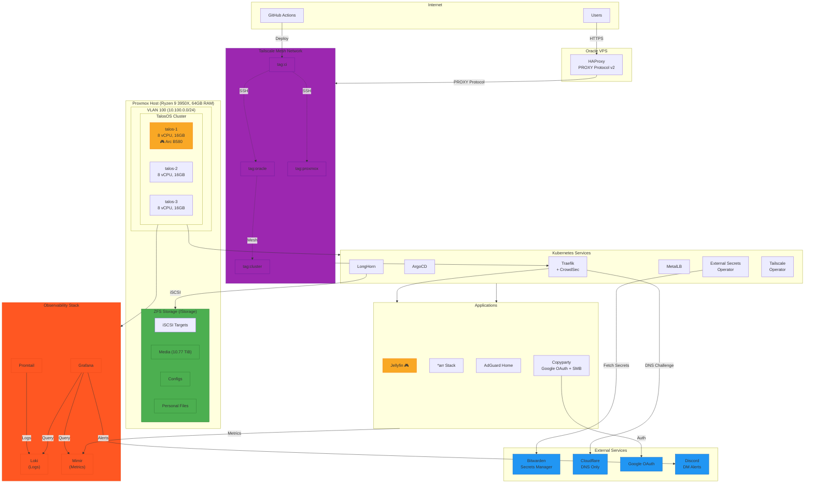

# Migration Plan: K3s → TalosOS with GitOps

Complete migration from K3s on Proxmox LXC containers to TalosOS VMs with full GitOps workflow.

---

## Architecture Diagram



---

## 1. Architecture Overview

### Current State

- K3s running on Proxmox LXC containers
- Manual configuration and deployments

### Target State

- **TalosOS** on Proxmox VMs (immutable, API-driven Kubernetes OS)
- **3 combined control-plane + worker nodes**
- **Intel Arc B580 GPU** passthrough to one node (talos-1)
- **GitOps** with ArgoCD for application deployment
- **Tailscale** mesh networking for multi-cloud node joining and kubectl access
- **Bitwarden** for secrets management via External Secrets Operator
- **Oracle VPS** as HAProxy entry point only (not a K8s node)

### Host Resources

```
Host: MS-7C37 (Proxmox)
CPU: AMD Ryzen 9 3950X (32 threads) @ 5.41 GHz
GPU: Intel Arc B580 @ 2.85 GHz [Discrete]
RAM: 62.71 GiB total
Storage:
  - / (root): 93.93 GiB ext4
  - /Storage: 10.77 TiB ZFS pool (media, configs, personal files)
```

### VM Configuration (3 nodes)

| Node      | Role                   | vCPU | RAM    | Disk   | GPU            | IP          |
| --------- | ---------------------- | ---- | ------ | ------ | -------------- | ----------- |
| `talos-1` | control-plane + worker | 8    | 16 GiB | 64 GiB | Intel Arc B580 | 10.100.0.11 |
| `talos-2` | control-plane + worker | 8    | 16 GiB | 64 GiB | -              | 10.100.0.12 |
| `talos-3` | control-plane + worker | 8    | 16 GiB | 64 GiB | -              | 10.100.0.13 |

**Resource Allocation:**

- **Total allocated:** 24 vCPU, 48 GiB RAM (leaves ~15 GiB for Proxmox + headroom)
- **Remaining for host:** 8 threads, ~15 GiB RAM
- Each VM uses q35 machine type, OVMF BIOS, VirtIO SCSI
- `talos-1` gets GPU passthrough via `hostpci` block

---

## 2. Infrastructure Components

### 2.1 Terraform (Infrastructure as Code)

**Providers:**

- `bpg/proxmox` - Proxmox VM provisioning with GPU passthrough
- `siderolabs/talos` - TalosOS cluster configuration
- `oci` - Oracle Cloud Infrastructure (VPS instance)
- `cloudflare` - DNS management
- `tailscale` - ACL policy management (GitOps)
- `bitwarden/bitwarden-secrets` - Secrets management (project & secrets creation)

**Resources to create:**

- **Proxmox:** TalosOS VMs (3x), GPU passthrough, machine configs, extensions
- **Oracle VPS:** Compute instance for HAProxy (bootstrapped by Ansible)
- **Cloudflare:** DNS records for cluster endpoints
- **Tailscale:** ACL policy with tag-based rules
- **Bitwarden:** `interstellar` project with infrastructure secrets

**Bitwarden Secrets Manager:** Use `bitwarden/bitwarden-secrets` provider to reference secrets via data sources.

**Pre-requisites (Must establish manually before Terraform):**

1. Create `OCIAccess` project in Bitwarden.
2. Create `interstellar` project in Bitwarden.
3. Populate the "Manual" secrets listed below.

**Bitwarden Project Structure:**

| Project        | Secrets                                   | Managed By |
| -------------- | ----------------------------------------- | ---------- |
| `OCIAccess`    | OCI API credentials for Terraform backend | Manual     |
| `interstellar` | Infrastructure secrets                    | Mixed      |

**Secrets in `OCIAccess` Project (manually created):**

| Key                | Description                       |
| ------------------ | --------------------------------- |
| `oci-tenancy-ocid` | OCI Tenancy OCID for backend auth |
| `oci-user-ocid`    | OCI User OCID for backend auth    |
| `oci-fingerprint`  | OCI API Key fingerprint           |
| `oci-private-key`  | OCI API private key (PEM format)  |
| `oci-region`       | OCI region (e.g., us-ashburn-1)   |
| `oci-namespace`    | OCI Object Storage namespace      |

**Secrets in `interstellar` Project:**

| Key                                   | Description                           | Source    |
| ------------------------------------- | ------------------------------------- | --------- |
| `tailscale-api-key`                   | Tailscale API key for ACL sync        | Manual    |
| `tailscale-tailnet`                   | Tailscale tailnet name                | Manual    |
| `tailscale-oauth-client-id`           | Tailscale OAuth client ID (for CI)    | Manual    |
| `tailscale-oauth-secret`              | Tailscale OAuth secret (for CI)       | Manual    |
| `google-oauth-client-id`              | Google OAuth client ID (Copyparty)    | Manual    |
| `google-oauth-client-secret`          | Google OAuth client secret            | Manual    |
| `google-oauth-cookie-secret`          | OAuth2-Proxy cookie secret            | Manual\*  |
| `jellyfin-google-oauth-client-id`     | Google OAuth client ID (Jellyfin)     | Manual    |
| `jellyfin-google-oauth-client-secret` | Google OAuth client secret (Jellyfin) | Manual    |
| `copyparty-admins`                    | Comma-separated admin emails          | Manual    |
| `copyparty-writers`                   | Comma-separated writer emails         | Manual    |
| `crowdsec-api-key`                    | CrowdSec LAPI key                     | Manual    |
| `cloudflare-api-token`                | Cloudflare API token for DNS          | Manual    |
| `proxmox-api-token-id`                | Proxmox API token ID                  | Manual    |
| `proxmox-api-token-secret`            | Proxmox API token secret              | Manual    |
| `discord-webhook-url`                 | Discord DM webhook for alerts         | Manual    |
| `tailscale-auth-key`                  | Cluster auth key                      | Terraform |

**(\*) Note:** `google-oauth-cookie-secret` must be a random 32-byte string (base64 encoded) generated securely (e.g., `openssl rand -base64 32`).

**TalosOS Extensions:**

- `qemu-guest-agent` - Proxmox integration
- `iscsi-tools` - LongHorn iSCSI storage
- `util-linux-tools` - Required utilities
- `tailscale` - Mesh networking
- `intel-ucode` - Intel microcode updates
- `siderolabs/intel-driver-modules` - Intel GPU drivers (for Arc B580)

### 2.2 Proxmox Configuration

**Host IP:** 192.168.1.10 (Management & iSCSI target)

**VLAN Setup:** Configure `/etc/network/interfaces` on Proxmox:

- `vmbr0` (192.168.1.0/24) - Main LAN with personal devices
- `vmbr0.100` - VLAN 100 tagged interface
- `vmbr1` (10.100.0.0/24) - Cluster bridge with NAT to internet

**Proxmox Firewall Rules:**

| #   | Action | Source         | Dest            | Proto | DPort    | Comment                   |
| --- | ------ | -------------- | --------------- | ----- | -------- | ------------------------- |
| 1   | ACCEPT | 10.100.0.0/24  | 0.0.0.0/0       | tcp   | 80,443   | Cluster → Internet HTTP/S |
| 2   | ACCEPT | 10.100.0.0/24  | 0.0.0.0/0       | udp   | 53,41641 | Cluster → DNS, Tailscale  |
| 3   | ACCEPT | 10.100.0.0/24  | 192.168.1.10/32 | tcp   | 3260     | Cluster → Proxmox iSCSI   |
| 4-6 | DROP   | 10.100.0.0/24  | RFC1918 ranges  | -     | -        | Block cluster → LAN       |
| 7   | ACCEPT | 192.168.1.0/24 | 10.100.0.0/24   | -     | -        | Personal → Cluster (all)  |

**NAT:** Add iptables MASQUERADE rule for 10.100.0.0/24 → vmbr0

**Storage (targetcli on Proxmox host):**

- **Unified LUN:** Single 8T zvol passed to LongHorn for all storage needs (see Section 5).

### 2.3 Oracle VPS (HAProxy Entry Point)

**Purpose:** Public internet entry point with PROXY protocol, NOT a Kubernetes node

**Provisioning:** Terraform (`oci` provider) creates VM.Standard.A1.Flex instance → Ansible configures

**Configuration:**

- Tailscale installed on Ubuntu host (not containerized)
- Docker Compose runs HAProxy + Watchtower
- HAProxy uses `network_mode: host` to access Tailscale interface
- Backend targets: `talos-traefik:80` and `talos-traefik:443` with `send-proxy-v2`

**Auto-Updates:**

- Watchtower: Daily container image updates (2 AM UTC)
- unattended-upgrades: Daily system package updates (3 AM UTC) with auto-reboot

---

## 3. Kubernetes Bootstrap Components

### 3.1 MetalLB (LoadBalancer)

- L2 advertisement for LoadBalancer IPs on VLAN
- **IP Pool:** `10.100.0.100-10.100.0.120` (Reserved for Services)

### 3.2 LongHorn (Storage)

- Distributed block storage backed by Proxmox iSCSI targets
- Replicated volumes for high availability (default: 3 replicas)
- CSI driver for dynamic provisioning
- Web UI for management and monitoring

### 3.3 Traefik (Ingress Controller)

**Features:**

- PROXY protocol support (from Oracle HAProxy)
- CrowdSec bouncer middleware integration
- Timeout and rate-limiting middlewares
- **Default middlewares applied globally** via Traefik static config (`entryPoints.websecure.http.middlewares`)

**Middlewares:**

| Middleware             | Purpose                         | Applied             |
| ---------------------- | ------------------------------- | ------------------- |
| `security-headers`     | HSTS, XSS protection, etc.      | Global (all routes) |
| `crowdsec`             | ForwardAuth to CrowdSec bouncer | Per-route           |
| `timeout-standard`     | 60s read/write, 180s idle       | Per-route           |
| `timeout-streaming`    | Unlimited for media streaming   | Per-route           |
| `rate-limit`           | 100 req/min, burst 200          | Per-route           |
| `rate-limit-streaming` | 1000 req/min (high burst)       | Per-route           |
| `tailscale-only`       | IP allowlist 100.64.0.0/10      | Per-route           |

**Global Configuration:** Add `security-headers` to Traefik static config so it applies to all IngressRoutes by default:

```yaml
# traefik/config.yaml
entryPoints:
  websecure:
    http:
      middlewares:
        - security-headers@file # Applied to ALL routes automatically
```

**Middleware Chains (security-headers implicit):**

| Chain             | Middlewares                                         | Use Case            |
| ----------------- | --------------------------------------------------- | ------------------- |
| `public-chain`    | crowdsec → rate-limit → timeout-standard            | Public web services |
| `streaming-chain` | crowdsec → rate-limit-streaming → timeout-streaming | Jellyfin, streaming |
| `tailscale-only`  | tailscale-only → timeout-standard                   | Internal services   |

### 3.4 CrowdSec (Security)

**Components:**

- **LAPI** - Local API for decision engine
- **Traefik Bouncer** - Middleware for blocking malicious IPs
- **Collections** - crowdsecurity/traefik, crowdsecurity/http-cve

### 3.4.1 Antivirus / Malware Scanning (Requirement)

**Goal:** scan _file ingress_ for malware (user uploads + torrent downloads) before files are made broadly accessible.

- **TalosOS nodes:** no traditional host AV agent (immutable OS); implement scanning as Kubernetes workloads (CronJob/Job/sidecar) and rely on image provenance/scanning and Kubernetes security controls.

**Scanning scope (what MUST be covered):**

- **User ingress from Copyparty** (new uploads)
- **qBittorrent ingress** (newly completed downloads, before import/move into libraries)

**Quarantine Workflow Implementation:**

**Directory Structure:**

```
/downloads/
├── quarantine/       # qBittorrent downloads here first
└── completed/        # Clean files moved here for *arr import

/personal/public/
├── .quarantine/      # Copyparty uploads here first (hidden folder)
└── ... (regular files after scan)
```

**qBittorrent Configuration:**

- Set download path to `/downloads/quarantine`
- Configure \*arr apps to monitor `/downloads/completed` only
- Post-download script disabled (ClamAV handles moves)

**Copyparty Configuration:**

- Option 1: Configure upload target to `/personal/public/.quarantine` (requires Copyparty config change)
- Option 2: Use inotify sidecar to immediately move new uploads to `.quarantine`

**ClamAV CronJob (runs every 5 minutes):**

1. **Mount PVCs:** downloads-pvc, personal-pvc
2. **Update signatures:** Run `freshclam` (cache DB on 1Gi PVC)
3. **Scan quarantine directories:**
   - `/downloads/quarantine/*`
   - `/personal/public/.quarantine/*`
4. **On clean result:**
   - Move `/downloads/quarantine/file` → `/downloads/completed/file`
   - Move `/personal/public/.quarantine/file` → `/personal/public/file`
5. **On infected result:**
   - Keep in quarantine
   - Log to stdout (captured by Promtail → Loki)
   - Trigger Grafana alert → Discord notification
   - Optionally: move to `/quarantine-infected/` for manual review

**Environment Variables:**

```yaml
SCAN_PATHS: "/downloads/quarantine,/personal/public/.quarantine"
CLEAN_DEST_MAP: "/downloads/quarantine=/downloads/completed,/personal/public/.quarantine=/personal/public"
ALERT_WEBHOOK:
  valueFrom:
    secretKeyRef:
      name: clamav-secrets
      key: discord-webhook-url
```

**Observability:**

- ClamAV logs forwarded to Loki
- Grafana alert: `ClamAV detected malware` (critical)
- Discord DM sent with file path and threat name

**Notes:**

- Full recursive scans optional; focus on ingress paths
- Consider scheduling deep scans weekly during low-traffic periods

### 3.5 External Secrets Operator

**Provider:** Bitwarden Secrets Manager via SDK Server

- Sync secrets from Bitwarden to Kubernetes Secrets
- No secrets stored in Git repository

**Refresh Interval:** External Secrets Operator polls Bitwarden every 1 hour by default (configurable via `refreshInterval` in `ExternalSecret` resources).

**How Group Changes are Detected:**

1. Update `copyparty-admins` or `copyparty-writers` secret in Bitwarden (e.g., add/remove email addresses)
2. External Secrets Operator detects change on next poll (within 1 hour)
3. Kubernetes Secret is updated automatically
4. **Copyparty reload:** Copyparty does NOT auto-reload config files when Secrets change. Two options:
   - **Manual reload:** Restart Copyparty pod: `kubectl rollout restart deployment copyparty -n utilities`
   - **Automated reload (recommended):** Deploy [Reloader](https://github.com/stakater/Reloader) - watches Secrets/ConfigMaps and automatically restarts deployments when they change. Add annotation to Copyparty deployment: `reloader.stakater.com/auto: "true"`

**Recommended Setup:**

- Install Reloader (see section 3.6 below)
- Annotate Copyparty deployment to auto-restart on secret changes
- Changes propagate within 1 hour (Bitwarden poll) + pod restart time (~30s)

### 3.6 Reloader (Automatic Config Reload)

**Purpose:** Automatically restart pods when their referenced ConfigMaps or Secrets change

**Installation via Kustomize:**

```yaml
# Kubernetes/infrastructure/reloader/kustomization.yaml
apiVersion: kustomize.config.k8s.io/v1beta1
kind: Kustomization

namespace: reloader

resources:
  - https://github.com/stakater/Reloader/deployments/kubernetes

# Optional: Add custom labels
commonLabels:
  managed-by: argocd
```

**Apply:**

```bash
kubectl apply -k Kubernetes/infrastructure/reloader/
```

**ArgoCD Application:**

```yaml
# Kubernetes/infrastructure/kustomization.yaml
resources:
  - reloader/
```

**Usage Patterns:**

1. **Auto-reload all referenced resources:**

```yaml
apiVersion: apps/v1
kind: Deployment
metadata:
  name: copyparty
  annotations:
    reloader.stakater.com/auto: "true" # Watches all ConfigMaps/Secrets in the pod spec
spec:
  template:
    spec:
      containers:
        - name: copyparty
          envFrom:
            - secretRef:
                name: copyparty-secrets # Auto-reloaded when External Secrets updates this
```

2. **Reload specific resources:**

```yaml
metadata:
  annotations:
    secret.reloader.stakater.com/reload: "arr-api-keys,copyparty-secrets"
    configmap.reloader.stakater.com/reload: "arr-configurator-scripts"
```

**Deployments to Annotate:**

| Deployment      | Annotation                         | Reason                              |
| --------------- | ---------------------------------- | ----------------------------------- |
| `copyparty`     | `reloader.stakater.com/auto`       | Group changes from Bitwarden        |
| `oauth2-proxy`  | `reloader.stakater.com/auto`       | OAuth credential updates            |
| `jellyfin`      | Manual restart only                | API key changes (rare)              |
| `sonarr/radarr` | Not needed                         | API keys managed by configurator    |
| `traefik`       | `configmap.reloader...` (optional) | Manual reload preferred for ingress |

### 3.7 Tailscale Kubernetes Operator

**Features:**

- **API Server Proxy** - kubectl access via Tailscale without copying kubeconfig files
- **Subnet router** - Exposes pod/service CIDRs to Tailscale network
- **Service exposure** - Expose cluster services with Tailscale DNS names

### 3.7.1 kubectl Authentication via Tailscale

- Tailscale Operator creates a device for the Kubernetes API server
- Run `tailscale configure kubeconfig talos-operator` once to set up
- kubectl requests go through Tailscale's encrypted tunnel
- No kubeconfig files to copy, works from any Tailscale device

### 3.8 Observability Stack (Grafana LGTM)

**Components:**

| Component    | Purpose                            | Storage      |
| ------------ | ---------------------------------- | ------------ |
| **Grafana**  | Dashboards & alerting              | SQLite/PVC   |
| **Loki**     | Log aggregation                    | LongHorn PVC |
| **Mimir**    | Metrics (Prometheus-compatible)    | LongHorn PVC |
| **Promtail** | Log collector (DaemonSet)          | -            |
| **Alloy**    | Metrics collector (replaces agent) | -            |

**Alerting:** Discord DM via webhook stored in Bitwarden as `discord-webhook-url`

**Pre-configured Alert Rules:**

| Alert                     | Condition                 | Severity |
| ------------------------- | ------------------------- | -------- |
| `HighCPU`                 | Node CPU > 80% for 5m     | warning  |
| `HighMemory`              | Node Memory > 85% for 5m  | warning  |
| `PodCrashLooping`         | Pod restarts > 5 in 10m   | critical |
| `PodNotReady`             | Pod not ready for 5m      | warning  |
| `PVCAlmostFull`           | PVC usage > 85%           | warning  |
| `NodeNotReady`            | Node not ready for 5m     | critical |
| `CertificateExpiringSoon` | Cert expires in < 14 days | warning  |

**Application Metrics:** Use Exportarr sidecars for \*arr apps

### 3.9 Easy Public/Private App Toggle

**Middlewares:**

- `tailscale-only` - IP allowlist for 100.64.0.0/10 (Tailscale CGNAT)
- `public-access` - Rate limiting + security headers
- `security-headers` - HSTS, XSS protection, etc.

**App Access Table:**

| App         | Access Mode | Accessible From    |
| ----------- | ----------- | ------------------ |
| Jellyfin    | `public`    | Anyone on internet |
| Jellyseerr  | `public`    | Anyone on internet |
| Immich      | `public`    | Anyone on internet |
| Copyparty   | `public`    | Anyone (OAuth)     |
| MCPJungle   | `public`    | Anyone on internet |
| Prowlarr    | `private`   | Tailscale only     |
| Sonarr      | `private`   | Tailscale only     |
| Radarr      | `private`   | Tailscale only     |
| Bazarr      | `private`   | Tailscale only     |
| qBittorrent | `private`   | Tailscale only     |
| AdGuard     | `private`   | Tailscale only     |
| Grafana     | `private`   | Tailscale only     |

**Toggle Process:** Edit ingress.yaml, change middleware from `tailscale-only` ↔ `public-chain`, commit and push.

**Note:** HAProxy forwards all traffic to Traefik. Access control happens at Traefik middleware layer.

### 3.10 Network Policies

**Default Policy:** Deny All ingress/egress by default in all namespaces.

**Allow Rules:**

- **DNS:** Allow egress to CoreDNS (UDP/53)
- **Ingress:** Allow ingress from Traefik controller
- **Monitoring:** Allow ingress from Prometheus (Mimir) scraper
- **Storage:** Allow egress to iSCSI target (192.168.1.10:3260)
- **Apps:** Allow specific app-to-app communication (e.g. Sonarr → Prowlarr)

---

## 4. Tailscale ACL Policy (GitOps)

### 4.1 Tags

| Tag                | Purpose                |
| ------------------ | ---------------------- |
| `tag:ci`           | GitHub Actions runners |
| `tag:proxmox`      | Proxmox hosts          |
| `tag:oracle`       | Oracle VPS (HAProxy)   |
| `tag:cluster`      | All Kubernetes nodes   |
| `tag:k8s-operator` | Tailscale K8s operator |

### 4.2 Groups

| Group             | Purpose                                   |
| ----------------- | ----------------------------------------- |
| `group:vips`      | Admin-level access (full cluster control) |
| `group:silvernet` | Science club members                      |
| `group:media`     | Jellyfin/Jellyseerr access only           |
| `group:dns`       | AdGuard DNS access (port 53 only)         |

**Tailscale Group Permissions (ACL Rules):**

| Group             | Can Access                                | Cannot Access    |
| ----------------- | ----------------------------------------- | ---------------- |
| `group:vips`      | Everything (all tags, all devices)        | -                |
| `group:silvernet` | Cluster services, shared resources        | Personal devices |
| `group:media`     | `watch.nerine.dev`, `add.nerine.dev` only | Everything else  |
| `group:dns`       | AdGuard DNS (port 53 UDP/TCP)             | Everything else  |

### 4.3 Security Rules

- **Unidirectional access:** Cluster cannot initiate connections to personal devices
- **Media group isolation:** Only access to Jellyfin/Jellyseerr services
- **DNS group isolation:** Only access to AdGuard DNS (port 53)
- **Auto-approvers:** Exit node (Oracle), subnet routes (pod/service CIDRs)

### 4.4 Tailscale Auth Key

Generate via Terraform `tailscale_tailnet_key` resource:

- `reusable: true`, `preauthorized: true`, `expiry: 90 days`
- Tags: `["tag:cluster"]`
- Store in Bitwarden for External Secrets

### 4.5 GitHub Actions Sync

Use `tailscale/gitops-acl-action` with secrets fetched from Bitwarden via `bitwarden/sm-action`.
Only `BW_ACCESS_TOKEN` is stored in GitHub Secrets.

---

## 5. Storage Architecture

### 5.1 ZFS Pool on Proxmox (`/Storage`)

**Current:** 10.77 TiB ZFS pool mounted at `/Storage`

```
/Storage/
├── k8s/
    └── storage/    # 8T zvol for cluster (created via zfs create -V)
```

### 5.2 Proxmox iSCSI Target (via targetcli)

**Single unified storage:** Instead of multiple zvols, use one large zvol and let LongHorn handle partitioning via PVCs.

| Target                       | ZFS zvol              | Size | Purpose             |
| ---------------------------- | --------------------- | ---- | ------------------- |
| `iqn.2026-01.dev.nerine:k8s` | `Storage/k8s/storage` | 8T   | All cluster storage |

**Create zvol on Proxmox:**

```bash
zfs create -V 8T Storage/k8s/storage
```

**Configure iSCSI target (targetcli):**
_Note: Enable CHAP authentication for security._

```bash
targetcli /backstores/block create k8s-storage /dev/zvol/Storage/k8s/storage
targetcli /iscsi create iqn.2026-01.dev.nerine:k8s
targetcli /iscsi/iqn.2026-01.dev.nerine:k8s/tpg1/luns create /backstores/block/k8s-storage
targetcli /iscsi/iqn.2026-01.dev.nerine:k8s/tpg1/acls create iqn.2026-01.dev.nerine:talos-1
targetcli /iscsi/iqn.2026-01.dev.nerine:k8s/tpg1/acls create iqn.2026-01.dev.nerine:talos-2
targetcli /iscsi/iqn.2026-01.dev.nerine:k8s/tpg1/acls create iqn.2026-01.dev.nerine:talos-3
```

targetcli saveconfig

### 5.3 LongHorn Storage Classes

````

### 5.3 LongHorn Storage Classes

**Single default storage class:** LongHorn provisions PVCs dynamically from the unified iSCSI target.

| StorageClass   | Backend    | Access        | Use Case              |
| -------------- | ---------- | ------------- | --------------------- |
| `longhorn`     | k8s iSCSI  | ReadWriteOnce | All apps (default)    |
| `longhorn-rwx` | k8s iSCSI  | ReadWriteMany | Shared storage (RWX)  |

**Storage Flow:** ZFS Pool → zvol (8T) → iSCSI Target → Longhorn CSI → PVCs → Pods

### 5.4 Data Migration

1. Keep ZFS pool intact during migration
2. Create single 8T zvol for iSCSI
3. LongHorn provisions PVCs dynamically
4. Copy data from existing `/Storage/Media`, `/Storage/Configs`, etc. to new PVCs
5. Verify, then clean up old structure

---

## 6. Copyparty (File Server)

### 6.1 Authentication

- **Google OAuth** via OAuth2-Proxy for all web access
- `auth-ord: idp` - No password fallback, IdP only
- `idp-h-usr: X-Forwarded-User` - User header from OAuth2-Proxy

### 6.2 SMB Configuration

- **Port:** 3945 (non-privileged)
- **Access:** Tailscale network only (`ipa: 100.64.0.0/10`)
- **Security:** Do NOT use auto-auth (`guest`) for entire subnet. Map specific Tailscale machines or users to the guest account to prevent generalized access.
  - `ipu: 100.64.x.y=guest` (Map specific device IP)

### 6.3 Access Control

**Copyparty Permission Flags:**

| Flag | Permission  | Description                                |
| ---- | ----------- | ------------------------------------------ |
| `r`  | Read        | View/download files and folders            |
| `w`  | Write       | Upload new files                           |
| `m`  | Move        | Rename and move files                      |
| `d`  | Delete      | Delete files and folders                   |
| `a`  | Admin       | Change permissions, manage volume settings |
| `g`  | Get         | See own uploads only (upget)               |
| `G`  | Get (write) | Upload + see own uploads                   |

**Group Operations by Volume:**

| Volume             | `@admins`            | `@writers`  | `@acct`       | `guest`      |
| ------------------ | -------------------- | ----------- | ------------- | ------------ |
| `/personal`        | rwmda (full control) | -           | -             | -            |
| `/personal/public` | rwmda (full control) | rw (upload) | r (view only) | r (SMB read) |
| `/media`           | r (view)             | -           | -             | r (SMB read) |

**Volumes:**
| Volume | Public Access | SMB Shared | Permissions |
|--------|---------------|------------|-------------|
| `/personal` | No | No (private) | `rwmda: @admins` |
| `/personal/public` | Yes (Google OAuth) | Yes (Tailscale machine sharing) | `rwmda: @admins`, `rw: @writers`, `r: @acct` |
| `/media` | No | Yes (Tailscale, read-only) | `r: @admins`, `r: guest` |

### 6.4 Configuration Notes

- `auth-ord: idp` enforces IdP-only (no password fallback)
- `idp-h-usr: X-Forwarded-User` gets user from OAuth2-Proxy
- SMB on port 3945, restricted to Tailscale CGNAT range (`ipa: 100.64.0.0/10`)
- Groups loaded from Bitwarden-synced secrets via `%{inc:/cfg/secrets/admins}%`

### 6.5 Immich (Photo Management)

**Purpose:** Self-hosted Google Photos alternative

**Components:**

- immich-server (API + web UI)
- immich-machine-learning (GPU-accelerated, runs on talos-1)
- PostgreSQL with pgvecto-rs extension
- Redis for job queue (deployed as separate pod/service)

**Features:** Facial recognition, CLIP search, duplicate detection, auto-backup, shared albums

### 6.6 MCPJungle (MCP Server Registry)

**Purpose:** Self-hosted Model Context Protocol server registry for AI agent tool discovery

**Components:** MCPJungle server (Go) + PostgreSQL

---

## 7. Application Deployments

**Domain:** `nerine.dev`
**DNS Strategy:** AdGuard DNS rewrites ensure same domain works from internet, Tailscale, and localhost.

### 7.1 DNS Configuration

**Cloudflare DNS:** A records for public services pointing to Oracle VPS IP (DNS-only, no proxy). TLS termination at Traefik via Let's Encrypt dnsChallenge.

**AdGuard DNS Rewrites:** Wildcard `*.nerine.dev` → 10.100.0.100 (Traefik LB IP)

**Result:** Same URL works everywhere - AdGuard resolves locally, Cloudflare resolves externally via Oracle VPS.

### 7.2 Public Services (Internet + Tailscale + Localhost)

| Application | Domain              | Middleware Chain | Notes                    |
| ----------- | ------------------- | ---------------- | ------------------------ |
| Jellyfin    | `watch.nerine.dev`  | streaming-chain  | GPU transcoding          |
| Jellyseerr  | `add.nerine.dev`    | public-chain     | Request management       |
| Copyparty   | `files.nerine.dev`  | public-chain     | File server (OAuth)      |
| Immich      | `photos.nerine.dev` | public-chain     | Photo management (OAuth) |
| MCPJungle   | `mcp.nerine.dev`    | public-chain     | MCP server registry      |

### 7.3 Tailscale-Only Services (Tailscale + Localhost)

| Application | Domain                   | Middleware Chain | Notes              |
| ----------- | ------------------------ | ---------------- | ------------------ |
| Sonarr      | `sonarr.nerine.dev`      | tailscale-only   | TV management      |
| Radarr      | `radarr.nerine.dev`      | tailscale-only   | Movie management   |
| Prowlarr    | `prowlarr.nerine.dev`    | tailscale-only   | Indexer management |
| Bazarr      | `bazarr.nerine.dev`      | tailscale-only   | Subtitles          |
| qBittorrent | `qbittorrent.nerine.dev` | tailscale-only   | Downloads          |
| Traefik     | `traefik.nerine.dev`     | tailscale-only   | Dashboard          |
| ArgoCD      | `argocd.nerine.dev`      | tailscale-only   | GitOps             |
| LongHorn    | `longhorn.nerine.dev`    | tailscale-only   | Storage UI         |
| AdGuard     | `dns.nerine.dev`         | tailscale-only   | DNS management UI  |

### 7.4 AdGuard Home

**Web UI:** `dns.nerine.dev` (Tailscale VIPs only)
**DNS Service:** Port 53 via hostNetwork, accessible to `group:dns` + tailnet

### 7.5 Shared Media Access

Jellyfin/Jellyseerr accessible to `group:media` users. Public access via Oracle VPS is the recommended approach for users who can't join the tailnet.

### 7.6 Auto-Configuration System (Init Containers + Sidecars)

The \*arr apps auto-configure via init containers and sidecars:

1. **Init containers** extract API keys from app config.xml files after startup
2. API keys stored in `arr-api-keys` Kubernetes Secret
3. **Sidecar** processes configure downstream apps (add download clients, connect Prowlarr to Sonarr/Radarr)
4. RBAC grants minimal permissions: get/patch secrets, list pods in media namespace

**ConfigMap:** `arr-configurator-scripts` contains bash scripts for each app configuration.
**Sidecar image:** `bitnami/kubectl` with mounted scripts and RBAC service account.

**Configuration Flow:**

1. qBittorrent starts first (no dependencies)
2. Sonarr/Radarr start, init container waits for qBittorrent
3. Configurator sidecar extracts API keys, stores in `arr-api-keys` Secret
4. Configurator adds qBittorrent as download client via API
5. Prowlarr configurator waits for Sonarr/Radarr keys, then auto-adds them as applications
6. Jellyfin starts, API key extracted and stored
7. Jellyseerr configurator waits for all keys, configures connections
8. Recyclarr/Decluttarr read API keys from Secret and run normally

### 7.7 Jellyfin SSO Authentication

**Plugin:** [jellyfin-plugin-sso](https://github.com/9p4/jellyfin-plugin-sso) - Enables SSO authentication via OpenID Connect (OIDC) and SAML.

**Installation:**

1. Add plugin repository to Jellyfin:
   - Repository URL: `https://raw.githubusercontent.com/9p4/jellyfin-plugin-sso/manifest-release/manifest.json`
   - Install from catalog: Dashboard → Plugins → Catalog → SSO-Auth
   - Restart Jellyfin after installation

2. Configure Google OAuth Provider via API (web UI available but API recommended):

```bash
curl -X POST "https://watch.nerine.dev/sso/OID/Add/google?api_key=JELLYFIN_API_KEY" \
  -H "Content-Type: application/json" \
  -d '{
    "oidEndpoint": "https://accounts.google.com",
    "oidClientId": "YOUR_GOOGLE_CLIENT_ID",
    "oidSecret": "YOUR_GOOGLE_CLIENT_SECRET",
    "enabled": true,
    "enableAuthorization": true,
    "enableAllFolders": true,
    "enabledFolders": [],
    "adminRoles": [],
    "oidScopes": ["email", "profile"],
    "enableLiveTv": false,
    "enableLiveTvManagement": false,
    "doNotValidateEndpoints": true,
    "doNotValidateIssuerName": false
  }'
````

**Google OAuth Setup:**

1. Create OAuth 2.0 credentials in [Google Cloud Console](https://console.cloud.google.com/apis/credentials)
2. Authorized redirect URIs:
   - `https://watch.nerine.dev/sso/OID/redirect/google`
   - `https://watch.nerine.dev/sso/OID/r/google`
3. Store `clientId` and `clientSecret` in Bitwarden as `jellyfin-google-oauth-client-id` and `jellyfin-google-oauth-client-secret`

**User Experience:**

- Users navigate to Jellyfin web UI
- Click "Sign in with SSO" → Select "google" provider
- Redirected to Google for authentication
- On first login, Jellyfin creates a new user account linked to Google email
- Subsequent logins auto-authenticate via Google

**Account Linking:**

- Existing Jellyfin users can link their Google accounts at `/SSOViews/linking`
- This allows them to switch from password to SSO authentication

---

## 8. Migration Phases

### Phase 1: Infrastructure

1. [ ] Set up Proxmox VLAN for cluster isolation
2. [ ] Configure targetcli iSCSI targets on Proxmox
3. [ ] Create Terraform configs for Proxmox VMs
4. [ ] Deploy TalosOS cluster with Terraform

### Phase 2: Kubernetes Bootstrap

1. [ ] Deploy Tailscale Operator
2. [ ] Deploy MetalLB
3. [ ] Deploy LongHorn (connect to iSCSI)
4. [ ] Deploy Traefik with PROXY protocol
5. [ ] Deploy CrowdSec (LAPI + bouncer)
6. [ ] Deploy External Secrets Operator + Bitwarden
7. [ ] Deploy malware scanning for file ingress (Copyparty uploads + qBittorrent completed downloads)

### Phase 3: GitOps Setup

1. [ ] Deploy ArgoCD
2. [ ] Configure Tailscale ACL GitHub Actions sync
3. [ ] Set up ApplicationSets for app deployment

### Phase 4: Applications

1. [ ] Deploy Copyparty with OAuth2-Proxy
2. [ ] Migrate media stack (Jellyfin, \*arr apps)
3. [ ] Deploy Immich with GPU-accelerated ML
4. [ ] Deploy MCPJungle MCP server registry
5. [ ] Configure IngressRoutes with middleware chains
6. [ ] Set up Oracle HAProxy entry point

### Phase 5: Validation

1. [ ] Test kubectl access via Tailscale
2. [ ] Test public access through Oracle → Traefik
3. [ ] Test SMB access from Tailscale devices
4. [ ] Test CrowdSec blocking
5. [ ] Verify VLAN isolation (cluster cannot reach personal devices)

---

## 9. Target File Structure

```
Interstellar/
├── .github/
│   └── workflows/
│       ├── tailscale-acl.yaml          # ACL sync (uses Bitwarden for secrets)
│       ├── terraform.yaml              # Terraform plan/apply
│       └── ansible.yaml                # Ansible playbook runs
├── Tailscale/
│   └── policy.hujson                   # Tailscale ACL policy
├── Terraform/
│   ├── bitwarden.tf                    # Bitwarden Secrets provider & data sources
│   ├── proxmox.tf                      # Proxmox VMs with GPU passthrough
│   ├── talos.tf                        # Talos cluster config
│   ├── cloudflare.tf                   # DNS records
│   ├── tailscale.tf                    # Tailscale auth key generation
│   ├── variables.tf                    # Variable definitions
│   └── outputs.tf                      # Outputs
├── Kubernetes/
│   └── talos/
│       ├── bootstrap/
│       │   ├── argocd/
│       │   ├── metallb/
│       │   ├── longhorn/
│       │   ├── traefik/
│       │   │   ├── deployment.yaml
│       │   │   ├── middlewares.yaml
│       │   │   └── config.yaml
│       │   ├── crowdsec/
│       │   │   ├── lapi.yaml
│       │   │   └── bouncer.yaml
│       │   ├── external-secrets/
│       │   │   ├── bitwarden-store.yaml  # ClusterSecretStore for Bitwarden
│       │   │   └── sdk-server.yaml       # Bitwarden SDK Server deployment
│       │   └── tailscale-operator/
│       └── apps/
│           ├── copyparty/
│           │   ├── deployment.yaml
│           │   ├── oauth2-proxy.yaml
│           │   ├── configmap.yaml        # copyparty.conf (references secrets)
│           │   ├── externalsecret.yaml   # Syncs admins/writers from Bitwarden
│           │   ├── service.yaml
│           │   └── ingressroute.yaml
│           ├── jellyfin/
│           ├── jellyseerr/
│           ├── sonarr/
│           ├── radarr/
│           └── ...
└── Ansible/
    ├── playbooks/
    │   ├── setup-proxmox.yaml          # VLAN, firewall, iSCSI targets
    │   └── setup-oracle.yaml           # HAProxy configuration
    └── tasks/
        └── setup-iscsi-target.yaml     # targetcli on Proxmox
```

---

## 10. GitHub Actions CI/CD

### 10.1 Workflows Summary

| Workflow             | Trigger                   | Purpose                          |
| -------------------- | ------------------------- | -------------------------------- |
| `terraform.yaml`     | Push/PR to `Terraform/**` | Plan on PR, apply on main        |
| `ansible.yaml`       | Push/PR to `Ansible/**`   | Lint on PR, run playbook on main |
| `tailscale-acl.yaml` | Push/PR to `Tailscale/**` | Validate on PR, apply on main    |

**Common Pattern:**

1. `bitwarden/sm-action@v2` fetches secrets from Bitwarden Secrets Manager
2. `tailscale/github-action@v3` joins tailnet with `tag:ci` for SSH access (Ansible only)
3. Validation on PR, apply on main branch push

### 10.2 Secrets Summary

**GitHub Secrets (2 only):**

| Secret                | Purpose                                           |
| --------------------- | ------------------------------------------------- |
| `BW_OCI_ACCESS_TOKEN` | Machine account for `OCIAccess` project (backend) |
| `BW_ACCESS_TOKEN`     | Machine account for `interstellar` project        |

**GitHub Variables:**

| Variable          | Purpose                        |
| ----------------- | ------------------------------ |
| `TF_STATE_BUCKET` | OCI Object Storage bucket name |
| `PROXMOX_HOST`    | Proxmox host address           |

**Bitwarden `OCIAccess` Project:** OCI backend credentials (tenancy-ocid, user-ocid, fingerprint, private-key, region, namespace)

**Bitwarden `interstellar` Project:** All infrastructure secrets (proxmox, tailscale, cloudflare, etc.)

### 10.3 First Deployment Bootstrap

**One-time setup:**

1. Create OCI API key manually, upload to OCI Console
2. Create Bitwarden `OCIAccess` project with OCI backend secrets
3. Create Bitwarden `interstellar` project (or let Terraform create it)
4. Create machine accounts for both projects, store tokens in GitHub Secrets
5. Set GitHub Variables

**Bootstrap sequence:**

1. Local Terraform init with `backend "local" {}`
2. Create OCI bucket: `terraform apply -target=oci_objectstorage_bucket.terraform_state`
3. Migrate to OCI backend: update `backend.tf`, run `terraform init -migrate-state`
4. Full apply: `terraform apply`
5. GitHub Actions can run normally thereafter

---

## 11. File Cleanup (Obsolete K3s/LXC Files)

The following files are removed as they're for the old K3s on LXC architecture:

### Terraform (LXC Container Provisioning)

| File                            | Reason                               |
| ------------------------------- | ------------------------------------ |
| `Terraform/proxmox.tf`          | LXC container provisioning           |
| `Terraform/deployment.tf`       | K3s deployment key & OCI inventory   |
| `Terraform/oracle.tf`           | Old OCI instance (rewrite for state) |
| `Terraform/variables.tf`        | LXC-focused variables                |
| `Terraform/setup.sh`            | Old OCI authentication script        |
| `Terraform/.terraform.lock.hcl` | Lock file for old providers          |

### Ansible (K3s/LXC Management)

| File                                                  | Reason                          |
| ----------------------------------------------------- | ------------------------------- |
| `Ansible/k3s.yaml`                                    | K3s installation playbook       |
| `Ansible/setup-containers.yaml`                       | LXC container setup             |
| `Ansible/setup-nvidia.yaml`                           | NVIDIA for containers (not VMs) |
| `Ansible/proxy.yaml`                                  | Old proxy on argon host         |
| `Ansible/vars/containers.yaml`                        | LXC container config            |
| `Ansible/vars/nvidia.yaml`                            | NVIDIA driver version           |
| `Ansible/tasks/update_container_configs.yaml`         | LXC config tasks                |
| `Ansible/tasks/discover_proxmox.yaml`                 | Proxmox container discovery     |
| `Ansible/tasks/install_nvidia_drivers.yaml`           | NVIDIA driver installation      |
| `Ansible/tasks/install_nvidia_container_toolkit.yaml` | NVIDIA container toolkit        |

### Root Files

| File                     | Reason                               |
| ------------------------ | ------------------------------------ |
| `.env.authentik.example` | Authentik replaced by Google OAuth   |
| `.secrets.exmaple`       | Old secrets format (Bitwarden now)   |
| `current_acls.json`      | Tailscale ACLs managed via Terraform |
| `scripts/setup.sh`       | Old OCI download script              |

### Kept for Reference

- `Kubernetes/` - Kept as reference for app configuration migration
- `compose.proxy.yaml` - Updated for new architecture
- `haproxy.cfg` - Updated for Tailscale MagicDNS

### GitHub Actions (Removed)

| Workflow           | Reason                               |
| ------------------ | ------------------------------------ |
| `kubernetes.yaml`  | K3s `kubectl apply` to `nickel` host |
| `terraform.yaml`   | Old LXC Terraform & OCI bucket setup |
| `maintenance.yaml` | References deleted playbooks         |
| `nvidia.yaml`      | NVIDIA driver setup for containers   |
| `proxy.yaml`       | Old proxy setup (deleted playbook)   |
