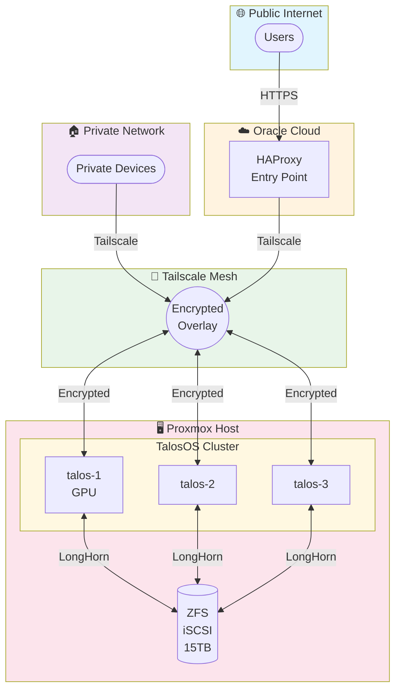

# Interstellar Homelab

A GitOps-managed Kubernetes homelab running TalosOS on Proxmox, with secure public access via Tailscale mesh networking and an Oracle VPS entry point.

## 🌐 Architecture Overview



## 🛠️ Technology Stack

| Layer             | Technology                                             |
| ----------------- | ------------------------------------------------------ |
| **OS**            | TalosOS (immutable Linux)                              |
| **Orchestration** | Kubernetes                                             |
| **GitOps**        | ArgoCD (app-of-apps pattern)                           |
| **Networking**    | Flannel CNI, MetalLB L2, Tailscale                     |
| **Ingress**       | Traefik v3.3 with PROXY protocol + CrowdSec plugin     |
| **Storage**       | LongHorn CSI → iSCSI → ZFS zvol                        |
| **Secrets**       | Bitwarden Secrets Manager + External Secrets Operator  |
| **Security**      | CrowdSec WAF (Traefik plugin), ClamAV malware scanning |
| **Observability** | Grafana, Loki, Mimir, Promtail, Alloy                  |
| **IaC**           | Terraform, Ansible, GitHub Actions                     |

## 🖥️ Hardware

### Proxmox Host

| Component   | Specification                                  |
| ----------- | ---------------------------------------------- |
| **CPU**     | Intel Core i5-12600K (6P + 4E cores)           |
| **RAM**     | 32GB DDR4                                      |
| **Storage** | 1TB NVMe + 15TB ZFS pool (5x3TB, iSCSI target) |
| **GPU**     | Intel Arc B580 (passed to talos-1)             |
| **Network** | 1Gbps + Tailscale mesh                         |

### TalosOS Cluster (3 nodes)

| Node    | vCPU | RAM  | Role                   | Special         |
| ------- | ---- | ---- | ---------------------- | --------------- |
| talos-1 | 8    | 16GB | Control Plane + Worker | GPU passthrough |
| talos-2 | 8    | 16GB | Control Plane + Worker | —               |
| talos-3 | 8    | 16GB | Control Plane + Worker | —               |

### Oracle VPS (Entry Point)

| Component    | Specification                 |
| ------------ | ----------------------------- |
| **Instance** | VM.Standard.A1.Flex (ARM)     |
| **CPU**      | 4 Ampere cores                |
| **RAM**      | 24GB                          |
| **Network**  | 4Gbps + public IP             |
| **Role**     | HAProxy → Tailscale → Traefik |

## 📦 Services

### Media Stack

| Service     | Access    | Description                       |
| ----------- | --------- | --------------------------------- |
| Jellyfin    | Public    | Media streaming (GPU transcoding) |
| Jellyseerr  | Public    | Media request management          |
| Sonarr      | Tailscale | TV show automation                |
| Radarr      | Tailscale | Movie automation                  |
| Prowlarr    | Tailscale | Indexer management                |
| Bazarr      | Tailscale | Subtitle management               |
| qBittorrent | Tailscale | Download client                   |
| Recyclarr   | Internal  | TRaSH guide sync                  |
| Decluttarr  | Internal  | Auto-cleanup                      |

### Utilities

| Service      | Access            | Description                   |
| ------------ | ----------------- | ----------------------------- |
| Copyparty    | Tailscale + OAuth | File sharing (GPU processing) |
| Immich       | Tailscale         | Photo management (ML on GPU)  |
| AdGuard Home | Tailscale         | DNS + ad blocking             |
| MCPJungle    | Internal          | MCP server aggregator         |

### Infrastructure

| Component          | Description                    |
| ------------------ | ------------------------------ |
| ArgoCD             | GitOps continuous deployment   |
| Traefik            | Ingress controller             |
| CrowdSec           | WAF + threat detection         |
| MetalLB            | Load balancer (L2 mode)        |
| LongHorn           | Distributed block storage      |
| External Secrets   | Bitwarden integration          |
| Tailscale Operator | Service mesh + auth            |
| Reloader           | Auto-reload on config changes  |
| ClamAV             | Malware scanning for downloads |

## 📂 Repository Structure

```
Interstellar/
├── .github/workflows/       # CI/CD pipelines
│   ├── terraform.yaml       # Infrastructure deployment
│   ├── ansible.yaml         # Host configuration
│   ├── kubernetes-lint.yaml # Manifest linting
│   └── tailscale-acl.yaml   # ACL policy sync
├── .kube-linter.yaml        # Kube-linter configuration
├── Ansible/                 # Host configuration playbooks
│   ├── setup-proxmox.yaml   # Host routing/NAT, iSCSI, firewall
│   └── setup-oracle.yaml    # HAProxy, Tailscale
├── Kubernetes/
│   ├── bootstrap/           # Core infrastructure
│   │   ├── argocd/
│   │   ├── metallb/
│   │   ├── longhorn/
│   │   ├── traefik/
│   │   ├── crowdsec/
│   │   ├── external-secrets/
│   │   ├── tailscale-operator/
│   │   ├── observability/
│   │   └── clamav/
│   └── apps/                # Application manifests
├── scripts/
│   └── lint-kubernetes.sh   # Local linting script
├── Tailscale/
│   └── policy.hujson        # ACL policy
├── Terraform/               # Infrastructure as Code
│   ├── proxmox.tf           # VM provisioning
│   ├── talos.tf             # Cluster configuration
│   ├── cloudflare.tf        # DNS records
│   ├── tailscale.tf         # Auth keys
│   ├── oracle.tf            # VPS infrastructure
│   └── bitwarden.tf         # Secret references
├── haproxy.cfg              # Oracle HAProxy config
└── compose.proxy.yaml       # HAProxy Docker Compose
```

## 🚀 Getting Started

All setup and bootstrap instructions live in [SETUP.md](SETUP.md). Use that file as the single source of truth.

## 🔒 Security Model

- **Network Topology**: Talos VMs are bridged directly to the home LAN (vmbr0)
- **Zero Trust**: All inter-service communication via Tailscale
- **Public Access**: Only through Oracle VPS → Tailscale → Traefik
- **Private Services**: Require Tailscale authentication
- **Malware Scanning**: ClamAV scans all downloaded files
- **WAF Protection**: CrowdSec with community threat feeds

## 📝 License

This project is for personal use and educational purposes.
