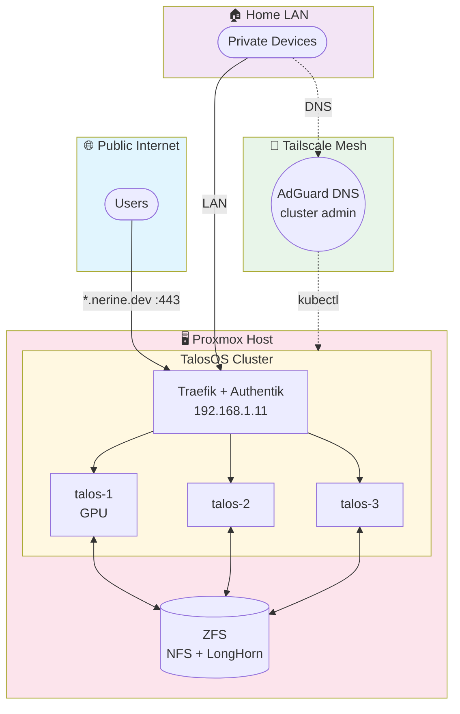

# Interstellar Homelab

A GitOps-managed Kubernetes homelab running TalosOS on Proxmox. Apps are published directly on the home connection through Traefik and gated by Authentik; Tailscale carries DNS and cluster administration.

## 🌐 Architecture Overview


```mermaid
flowchart TB
    subgraph Internet["🌐 Public Internet"]
        Users(["Users"])
    end

    subgraph Private["🏠 Home LAN"]
        Devices(["Private Devices"])
    end

    subgraph Tailscale["🔐 Tailscale Mesh"]
        TS(("AdGuard DNS<br/>cluster admin"))
    end

    subgraph Proxmox["🖥️ Proxmox Host"]
        subgraph Cluster["TalosOS Cluster"]
            Edge["Traefik + Authentik<br/>192.168.1.11"]
            T1["talos-1<br/>GPU"]
            T2["talos-2"]
            T3["talos-3"]
        end
        Storage[("ZFS<br/>NFS + LongHorn")]
    end

    Users -->|"*.nerine.dev :443"| Edge
    Devices -->|LAN| Edge
    Devices -.->|DNS| TS
    TS -.->|kubectl| Cluster
    Edge --> T1 & T2 & T3
    T1 & T2 & T3 <--> Storage

    style Internet fill:#e1f5fe
    style Private fill:#f3e5f5
    style Tailscale fill:#e8f5e9
    style Proxmox fill:#fce4ec
    style Cluster fill:#fff8e1
```

## 🛠️ Technology Stack

| Layer             | Technology                                             |
| ----------------- | ------------------------------------------------------ |
| **OS**            | TalosOS (immutable Linux)                              |
| **Orchestration** | Kubernetes                                             |
| **GitOps**        | ArgoCD (app-of-apps pattern)                           |
| **Networking**    | Flannel CNI, MetalLB L2, Tailscale                     |
| **Ingress**       | Traefik v3.7 with CrowdSec bouncer plugin              |
| **Storage**       | LongHorn CSI (app data) + NFS to ZFS (media)           |
| **Secrets**       | Bitwarden Secrets Manager + External Secrets Operator  |
| **Security**      | CrowdSec WAF (Traefik plugin) |
| **Observability** | Grafana, Loki, Mimir, Promtail, Alloy                  |
| **IaC**           | Terraform, Ansible, GitHub Actions                     |

## 🖥️ Hardware

### Proxmox Host

| Component   | Specification                                  |
| ----------- | ---------------------------------------------- |
| **CPU**     | Intel Core i5-12600K (6P + 4E cores)           |
| **RAM**     | 32GB DDR4                                      |
| **Storage** | 1TB NVMe + 15TB ZFS pool (5x3TB, NFS export)   |
| **GPU**     | Intel Arc B580 (passed to talos-1)             |
| **Network** | 1Gbps + Tailscale mesh                         |

### TalosOS Cluster (3 nodes)

| Node    | vCPU | RAM  | Role                   | Special         |
| ------- | ---- | ---- | ---------------------- | --------------- |
| talos-1 | 8    | 16GB | Control Plane + Worker | GPU passthrough |
| talos-2 | 8    | 16GB | Control Plane + Worker | —               |
| talos-3 | 8    | 16GB | Control Plane + Worker | —               |

### Oracle VPS

| Component    | Specification                 |
| ------------ | ----------------------------- |
| **Instance** | VM.Standard.A1.Flex (ARM)     |
| **CPU**      | 4 Ampere cores                |
| **RAM**      | 24GB                          |
| **Network**  | 4Gbps + public IP             |
| **Role**     | General compute / build host  |

## 📦 Services

### Media Stack

| Service     | Access    | Description                       |
| ----------- | --------- | --------------------------------- |
| Jellyfin    | OIDC      | Media streaming (GPU transcoding) |
| Seerr       | Authentik | Media request management          |
| Sonarr      | Authentik | TV show automation                |
| Radarr      | Authentik | Movie automation                  |
| Prowlarr    | Authentik | Indexer management                |
| Bazarr      | Authentik | Subtitle management               |
| qBittorrent | Authentik | Download client                   |
| Recyclarr   | Internal  | TRaSH guide sync                  |
| Decluttarr  | Internal  | Auto-cleanup                      |

### Utilities

| Service        | Access    | Description                           |
| -------------- | --------- | ------------------------------------- |
| Copyparty      | Authentik | File sharing                          |
| Immich         | OIDC      | Photo management (ML on GPU)          |
| AdGuard Home   | Authentik | Ad blocking; DNS served over Tailscale |
| Postfix        | Internal  | Outbound mail relay                   |
| Cloudflare DDNS| Internal  | Keeps the public A records current    |

### Infrastructure

| Component          | Description                    |
| ------------------ | ------------------------------ |
| ArgoCD             | GitOps continuous deployment   |
| Traefik            | Ingress controller             |
| CrowdSec           | WAF + threat detection         |
| MetalLB            | Load balancer (L2 mode)        |
| LongHorn           | Distributed block storage      |
| External Secrets   | Bitwarden integration          |
| Tailscale Operator | Tailnet DNS + cluster access   |
| Reloader           | Auto-reload on config changes  |

## 📂 Repository Structure

```
Interstellar/
├── .github/workflows/       # CI/CD pipelines
│   ├── terraform.yaml       # Infrastructure deployment
│   ├── terraform-apps.yaml  # App-level configuration
│   ├── terraform-destroy.yaml
│   ├── ansible.yaml         # Host configuration
│   ├── ansible-lint.yaml    # Playbook linting
│   └── kubernetes-lint.yaml # Manifest linting
├── .kube-linter.yaml        # Kube-linter configuration
├── Ansible/                 # Host configuration playbooks
├── Kubernetes/
│   ├── bootstrap/           # Core infrastructure
│   │   ├── argocd/
│   │   ├── metallb/
│   │   ├── longhorn/
│   │   ├── traefik/
│   │   ├── crowdsec/
│   │   ├── external-secrets/
│   │   ├── tailscale-operator/
│   │   ├── observability/
│   └── apps/                # Application manifests
├── scripts/
│   └── lint-kubernetes.sh   # Local linting script
├── Tailscale/
│   └── policy.hujson        # ACL policy
├── Terraform/               # Infrastructure as Code
│   ├── proxmox.tf           # VM provisioning
│   ├── talos.tf             # Cluster configuration
│   ├── cloudflare.tf        # DNS records
│   ├── tailscale.tf         # Auth keys
│   ├── oracle.tf            # VPS infrastructure
│   └── bitwarden.tf         # Secret references
```

## 🚀 Getting Started

All setup and bootstrap instructions live in [SETUP.md](SETUP.md). Local tool versions are pinned in `.mise.toml`, and `SETUP.md` is the single source of truth for bootstrapping the environment.

## 💾 Storage Configuration

NFS endpoint values are configured once in [Kubernetes/nfs-storage-config.yaml](Kubernetes/nfs-storage-config.yaml).

- `data.server`: NFS server IP/hostname
- `data.path`: NFS export path

Top-level Kustomize replacements apply these values to both the static media PV and the `nfs-csi` StorageClass.

## 🔒 Security Model

- **Network Topology**: Talos VMs are bridged directly to the home LAN (vmbr0)
- **Single gateway**: Every host resolves to Traefik, which terminates TLS and applies the CrowdSec bouncer
- **Public access**: Straight to the home connection on :80/:443; no off-site entry point
- **Authentication**: Authentik forward-auth on most hosts, the app's own OIDC on Jellyfin and Immich
- **WAF Protection**: CrowdSec with community threat feeds

## 📝 License

This project is for personal use and educational purposes.
